# CCA Architecture

This document provides a comprehensive overview of the CCA system architecture with detailed diagrams.

## High-Level Architecture

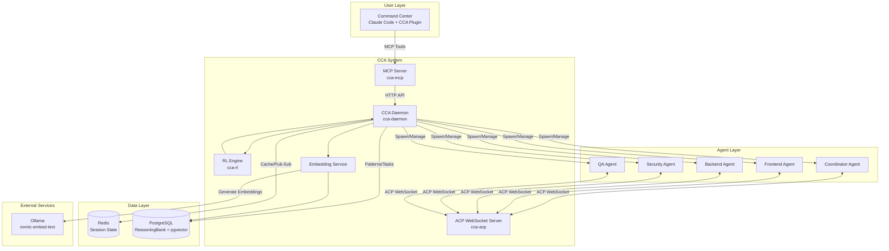

## Component Architecture

### CCA Daemon (Core Service)

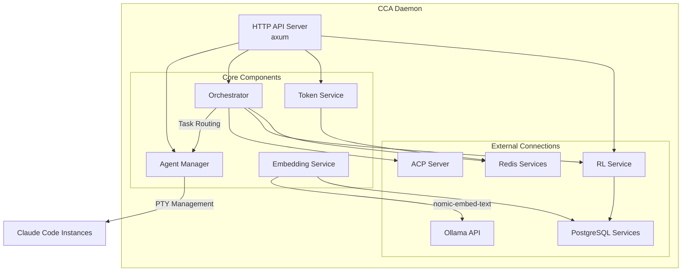

### Agent Manager

The Agent Manager handles spawning and managing Claude Code instances using PTY (pseudo-terminal).

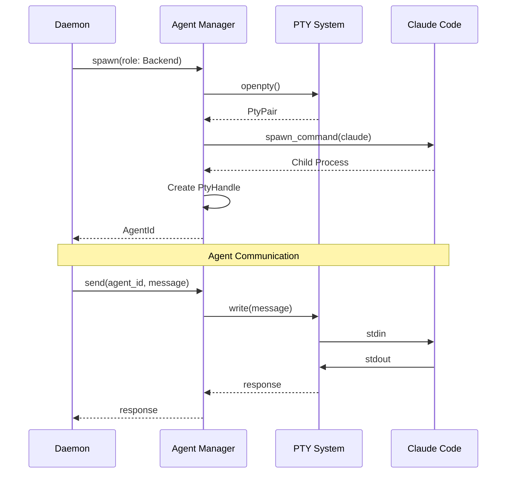

### Orchestrator

The Orchestrator handles task routing, delegation, and result aggregation.

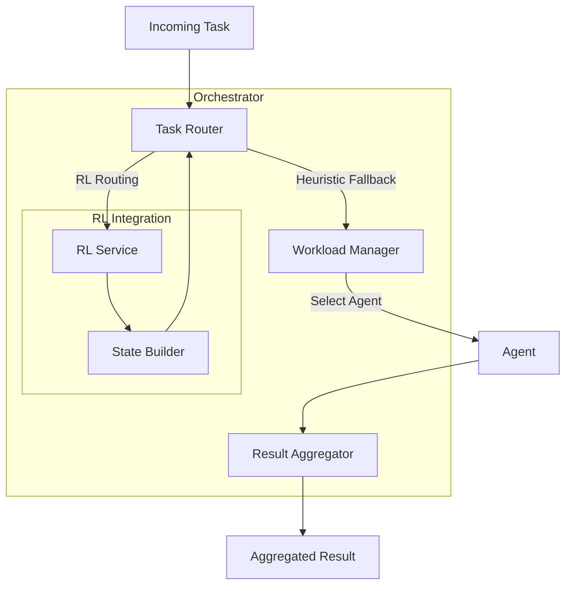

## Communication Flow

### Task Execution Flow

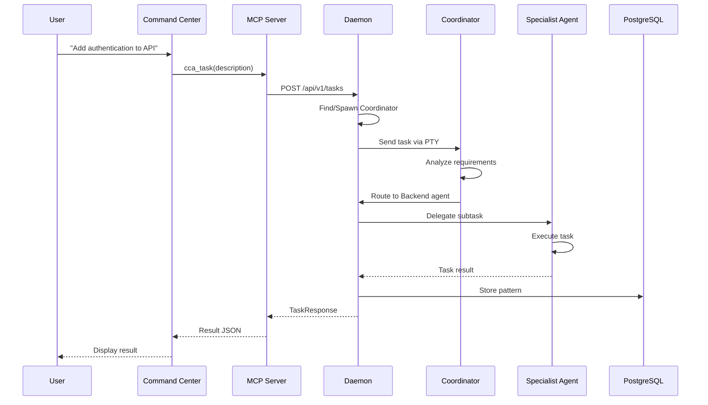

### ACP WebSocket Communication

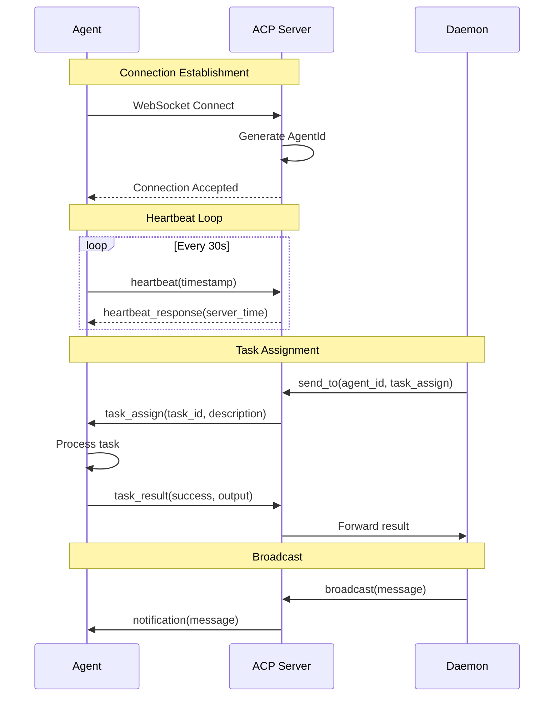

## Data Architecture

### Redis Data Model

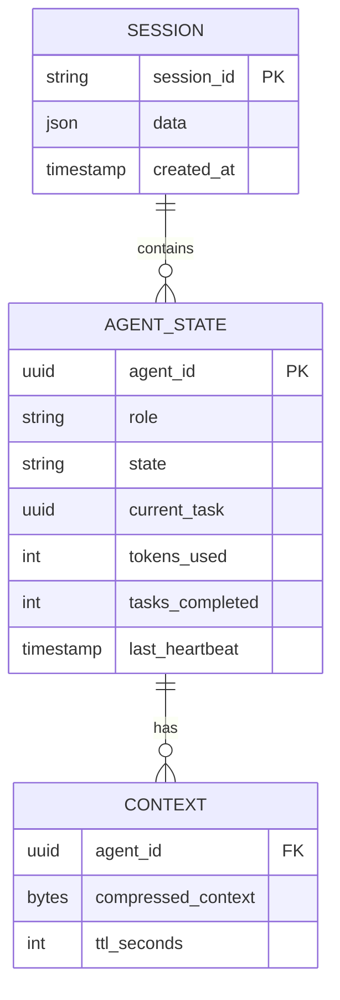

**Redis Key Patterns:**

| Pattern | Purpose |
|---------|---------|
| `cca:session:{id}` | Session data |
| `cca:agent:{id}:state` | Agent state |
| `cca:agent:{id}:context` | Compressed context |
| `cca:broadcast` | Broadcast channel |
| `cca:tasks:{agent_id}` | Task queue per agent |
| `cca:status` | Status updates |
| `cca:coord` | Coordination messages |

### PostgreSQL Schema

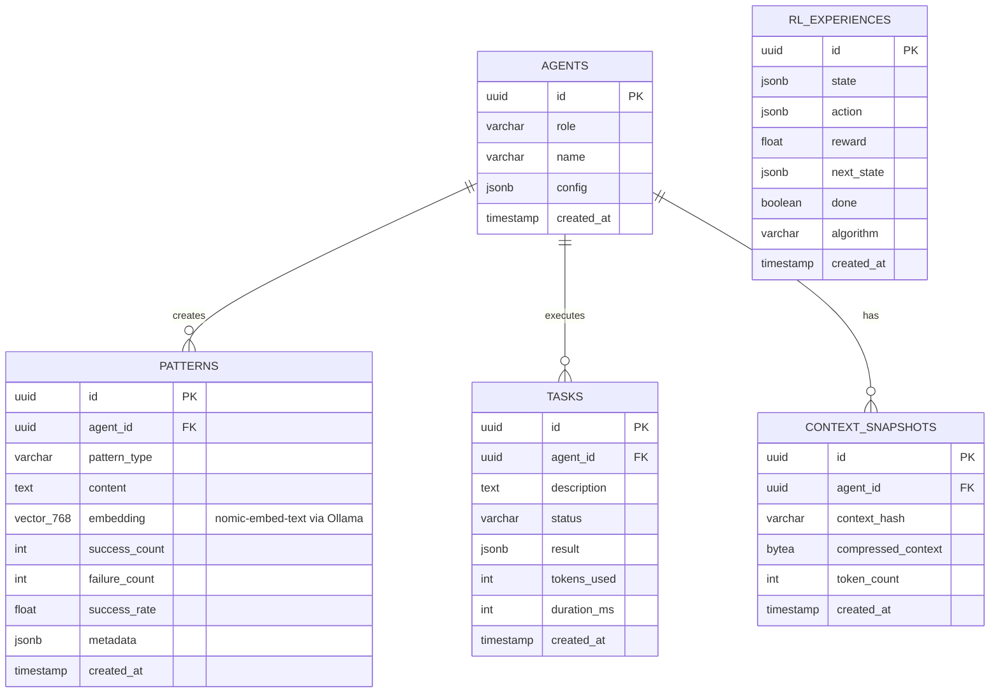

## Semantic Search with Embeddings

CCA uses vector embeddings to enable semantic similarity search for patterns in the ReasoningBank. This allows the system to find relevant patterns based on meaning rather than exact keyword matches.

### Embedding Service Architecture

```mermaid
graph TB
    subgraph "Embedding Service"
        ES[EmbeddingService]
        OC[Ollama Client]
        HC[Health Check]
    end

    subgraph "Ollama Server"
        OA[Ollama API<br/>:11434]
        NE[nomic-embed-text<br/>768 dimensions]
    end

    subgraph "Data Layer"
        PG[(PostgreSQL<br/>pgvector)]
        PT[patterns table<br/>vector(768)]
    end

    ES -->|HTTP POST /api/embeddings| OC
    OC -->|embed request| OA
    OA --> NE
    NE -->|768-dim vector| OC
    OC -->|Vec<f32>| ES

    ES -->|store embedding| PT
    PT --> PG
```

### Configuration

The embedding service is configured via the `[embeddings]` section in `cca.toml`:

```toml
[embeddings]
# Enable/disable embeddings (default: false)
enabled = true

# Ollama API base URL
ollama_url = "http://localhost:11434"

# Embedding model (nomic-embed-text produces 768-dim vectors)
model = "nomic-embed-text:latest"

# Expected embedding dimension (must match model output)
dimension = 768
```

Environment variables can also be used:
- `CCA__EMBEDDINGS__ENABLED=true`
- `CCA__EMBEDDINGS__OLLAMA_URL=http://localhost:11434`
- `CCA__EMBEDDINGS__MODEL=nomic-embed-text:latest`
- `CCA__EMBEDDINGS__DIMENSION=768`

### EmbeddingService API

The `EmbeddingService` provides the following capabilities:

| Method | Description |
|--------|-------------|
| `embed(text)` | Generate embedding for a single text |
| `embed_batch(texts)` | Generate embeddings for multiple texts |
| `health_check()` | Verify Ollama connectivity |
| `dimension()` | Get configured dimension (768) |
| `model()` | Get model name |

### Pattern Storage with Embeddings

Patterns are stored in PostgreSQL using the `pgvector` extension:

```mermaid
sequenceDiagram
    participant D as Daemon
    participant ES as EmbeddingService
    participant OL as Ollama
    participant DB as PostgreSQL

    D->>ES: embed(pattern_content)
    ES->>OL: POST /api/embeddings
    OL-->>ES: {embedding: [f32; 768]}
    ES-->>D: Vec<f32>
    D->>DB: INSERT patterns (content, embedding)
    DB-->>D: pattern_id
```

### Semantic Similarity Search

The system uses cosine similarity to find relevant patterns:

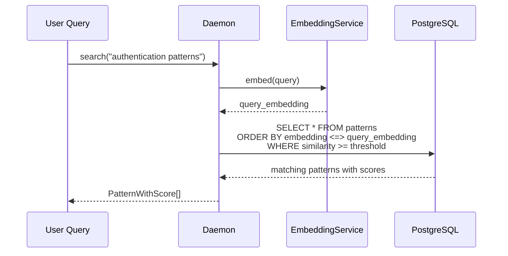

The PostgreSQL query uses IVFFlat indexing for efficient vector search:

```sql
-- Cosine similarity search
SELECT *, 1 - (embedding <=> $1) as similarity
FROM patterns
WHERE embedding IS NOT NULL
  AND 1 - (embedding <=> $1) >= $min_similarity
ORDER BY embedding <=> $1
LIMIT $limit
```

### Integration with ReasoningBank

Embeddings enhance the ReasoningBank's pattern retrieval:

```mermaid
graph LR
    subgraph "Pattern Operations"
        C[Create Pattern] -->|generate embedding| E[Store with Vector]
        Q[Query Patterns] -->|semantic search| S[Similarity Match]
        B[Backfill] -->|batch embed| U[Update Missing]
    end

    subgraph "Pattern Repository"
        CR[create(content, embedding)]
        SS[search_similar(embedding, limit, threshold)]
        UE[update_embedding(id, embedding)]
        GW[get_without_embeddings(limit)]
    end

    C --> CR
    Q --> SS
    B --> GW
    B --> UE
```

### Model Details: nomic-embed-text

| Property | Value |
|----------|-------|
| Dimensions | 768 |
| Context Length | 8192 tokens |
| Similarity Metric | Cosine |
| Provider | Ollama (local) |

The model is run locally via Ollama, providing:
- **Privacy**: No data leaves your infrastructure
- **Performance**: Local inference without network latency
- **Cost**: No per-token API costs

## Database Schema: Embeddings Storage

CCA stores vector embeddings in PostgreSQL using the `pgvector` extension. This section documents the schema design and migration path.

### pgvector Extension Setup

The `pgvector` extension is enabled in the initial migration (`migrations/init.sql`):

```sql
-- Enable required extensions
CREATE EXTENSION IF NOT EXISTS "uuid-ossp";
CREATE EXTENSION IF NOT EXISTS "vector";
```

### Patterns Table with Embeddings

The `patterns` table stores embeddings alongside pattern content:

```sql
CREATE TABLE IF NOT EXISTS patterns (
    id UUID PRIMARY KEY DEFAULT uuid_generate_v4(),
    agent_id UUID REFERENCES agents(id) ON DELETE SET NULL,
    pattern_type VARCHAR(50) NOT NULL,
    content TEXT NOT NULL,
    embedding vector(768),  -- nomic-embed-text dimension (via Ollama)
    success_count INTEGER DEFAULT 0,
    failure_count INTEGER DEFAULT 0,
    success_rate FLOAT GENERATED ALWAYS AS (
        CASE WHEN success_count + failure_count > 0
        THEN success_count::FLOAT / (success_count + failure_count)
        ELSE 0 END
    ) STORED,
    metadata JSONB DEFAULT '{}',
    created_at TIMESTAMPTZ DEFAULT NOW(),
    updated_at TIMESTAMPTZ DEFAULT NOW()
);
```

**Key columns:**

| Column | Type | Description |
|--------|------|-------------|
| `embedding` | `vector(768)` | nomic-embed-text embedding from Ollama |
| `content` | `TEXT` | Pattern text content that was embedded |
| `success_rate` | `FLOAT` | Auto-computed success ratio |

### IVFFlat Index for Vector Search

An IVFFlat index enables efficient cosine similarity search:

```sql
CREATE INDEX IF NOT EXISTS idx_patterns_embedding ON patterns
    USING ivfflat (embedding vector_cosine_ops) WITH (lists = 100);
```

**Index configuration:**

| Parameter | Value | Purpose |
|-----------|-------|---------|
| `ivfflat` | - | Approximate nearest neighbor index |
| `vector_cosine_ops` | - | Cosine distance operator class |
| `lists = 100` | - | Number of IVF lists for partitioning |

### Migration: 768-Dimension Update

The migration `migrations/002_embedding_dimension_768.sql` updates the schema from OpenAI's 1536 dimensions to Ollama's 768 dimensions:

```sql
-- Migration: Change embedding dimension from 1536 (OpenAI ada-002) to 768 (nomic-embed-text)
-- This migration is needed when switching from OpenAI embeddings to Ollama's nomic-embed-text model

-- Drop the existing index first (required to alter column type)
DROP INDEX IF EXISTS idx_patterns_embedding;

-- Alter the column to use 768 dimensions
-- Note: This will invalidate any existing embeddings - they will need to be regenerated
ALTER TABLE patterns
    ALTER COLUMN embedding TYPE vector(768);

-- Recreate the index with the new dimension
CREATE INDEX IF NOT EXISTS idx_patterns_embedding ON patterns
    USING ivfflat (embedding vector_cosine_ops) WITH (lists = 100);

-- Update the comment to reflect the new model
COMMENT ON COLUMN patterns.embedding IS 'nomic-embed-text embedding (768 dimensions via Ollama)';
```

**Migration notes:**

1. **Index must be dropped first** - PostgreSQL requires dropping indexes before altering the column type
2. **Existing embeddings invalidated** - Changing dimensions invalidates existing vectors; they must be regenerated
3. **Index recreated** - The IVFFlat index is recreated with the same configuration

### Rust Integration with pgvector

The Rust code uses the `pgvector` crate for native binary encoding:

```rust
use pgvector::Vector;

/// PERF-002: Convert f32 slice to pgvector's native Vector type
/// This avoids expensive string formatting and parsing for embeddings.
#[inline]
fn to_pgvector(embedding: &[f32]) -> Vector {
    Vector::from(embedding.to_vec())
}
```

This provides:
- **Binary encoding** instead of string formatting
- **Type safety** via `pgvector::Vector`
- **Performance** improvement over text-based embedding storage

### Vector Similarity Queries

The `PatternRepository` performs cosine similarity search:

```rust
// Use cosine similarity (1 - cosine_distance)
let rows = sqlx::query_as::<_, _>(
    r"
    SELECT *, 1 - (embedding <=> $1) as similarity
    FROM patterns
    WHERE embedding IS NOT NULL
      AND 1 - (embedding <=> $1) >= $3
    ORDER BY embedding <=> $1
    LIMIT $2
    ",
)
.bind(&embedding_vec)
.bind(limit)
.bind(min_similarity)
.fetch_all(&self.pool)
.await?;
```

**Query details:**

| Operator | Meaning |
|----------|---------|
| `<=>` | Cosine distance (0 = identical, 2 = opposite) |
| `1 - (<=>)` | Cosine similarity (1 = identical, -1 = opposite) |

### Dimension Comparison

| Model | Dimensions | Provider | Notes |
|-------|------------|----------|-------|
| OpenAI ada-002 | 1536 | OpenAI API | Previous default |
| nomic-embed-text | 768 | Ollama (local) | Current default |

The 768-dimension model provides:
- **50% storage reduction** compared to 1536 dimensions
- **Faster index operations** with smaller vectors
- **Local inference** without API costs

## Reinforcement Learning Architecture

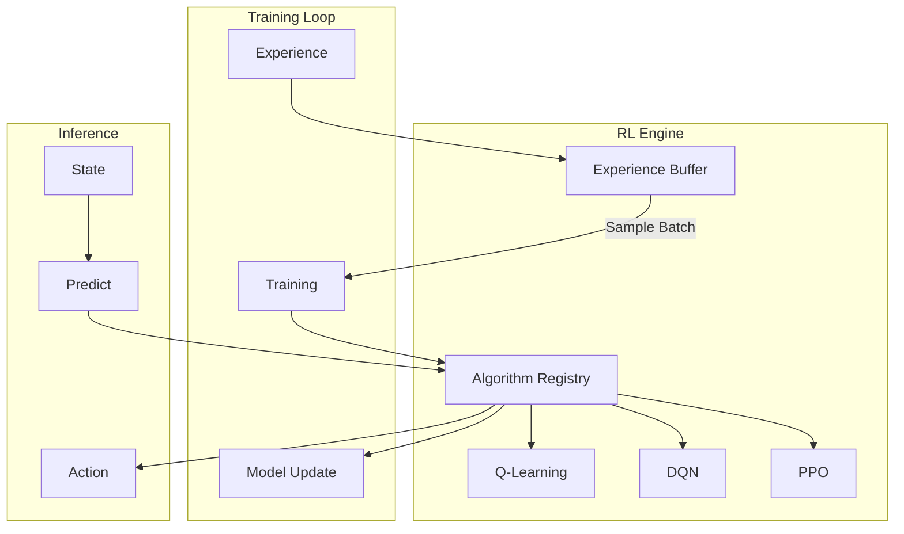

### RL State/Action Space

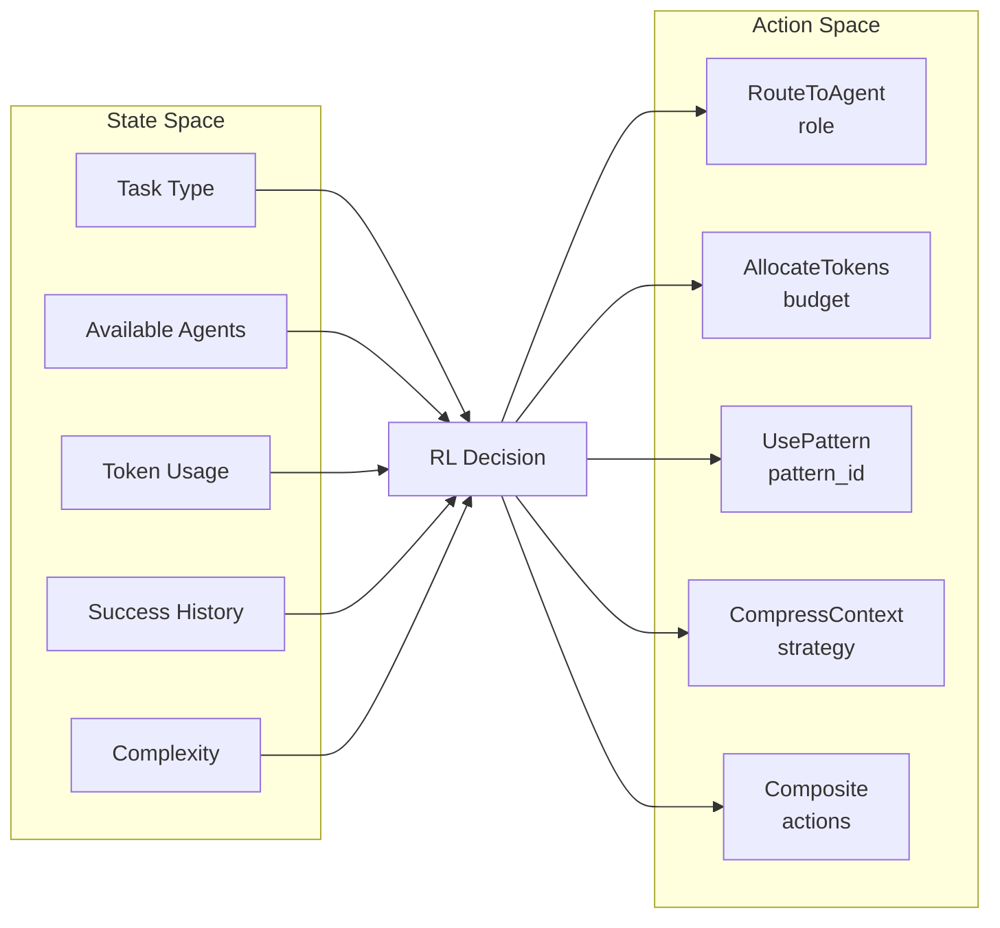

## Token Efficiency System

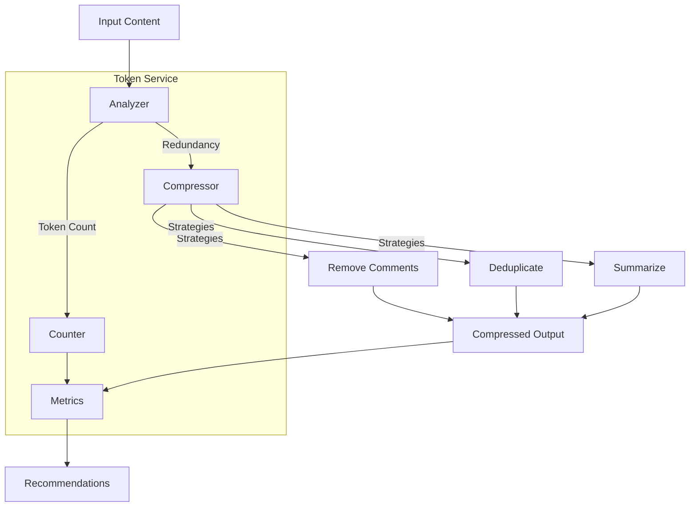

## Deployment Architecture

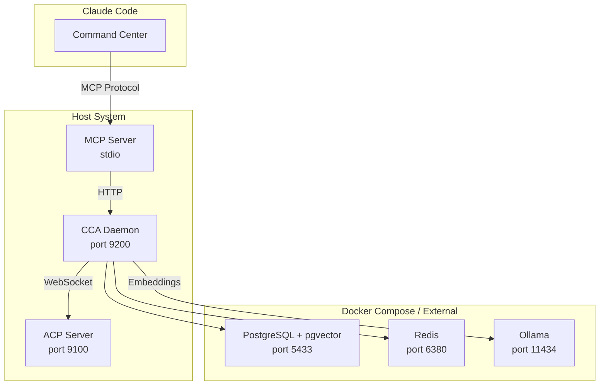

## Security Architecture

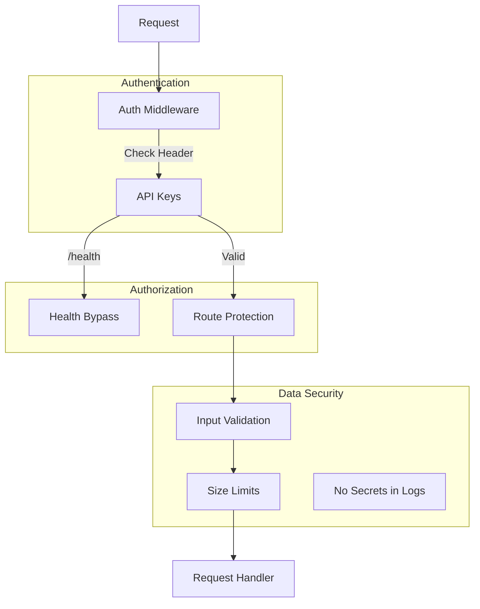

## Module Dependencies

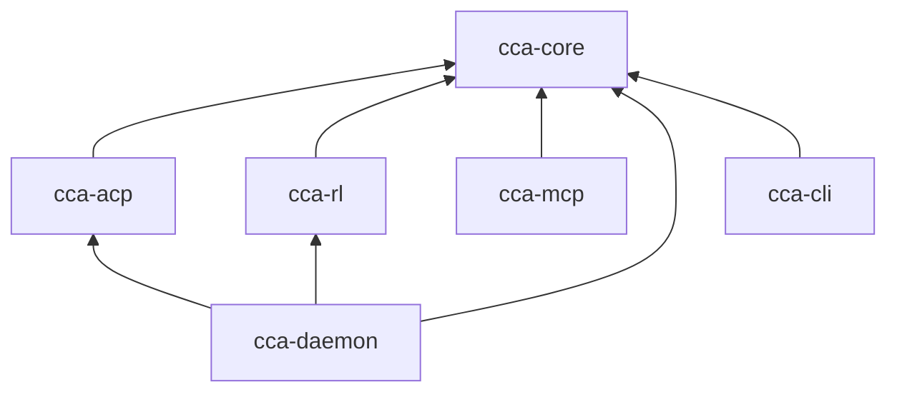

## Performance Considerations

### Connection Pooling

- **Redis**: Configured via `pool_size` (default: 10)
- **PostgreSQL**: Configured via `max_connections` (default: 20)

### Timeouts

| Component | Default Timeout |
|-----------|----------------|
| Agent task | 300 seconds |
| ACP request | 30 seconds |
| HTTP API | 120 seconds |
| PTY response | 30 seconds |

### Scalability

- **Horizontal**: Multiple daemon instances with shared Redis/PostgreSQL
- **Vertical**: Max agents configurable per daemon (default: 10)
- **Token efficiency**: Target 30% reduction in context size
