# CCA Architecture

This document provides a comprehensive overview of the CCA system architecture with detailed diagrams.

## High-Level Architecture

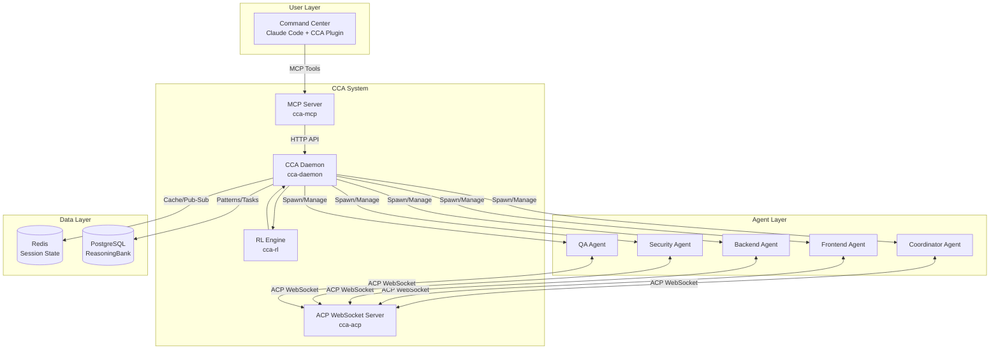

## Component Architecture

### CCA Daemon (Core Service)

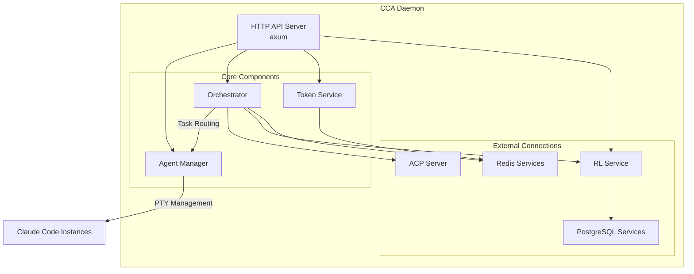

### Agent Manager

The Agent Manager handles spawning and managing Claude Code instances using PTY (pseudo-terminal).

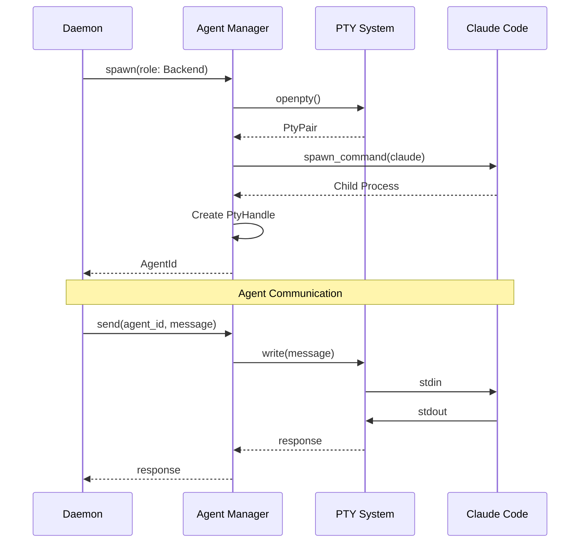

### Orchestrator

The Orchestrator handles task routing, delegation, and result aggregation.

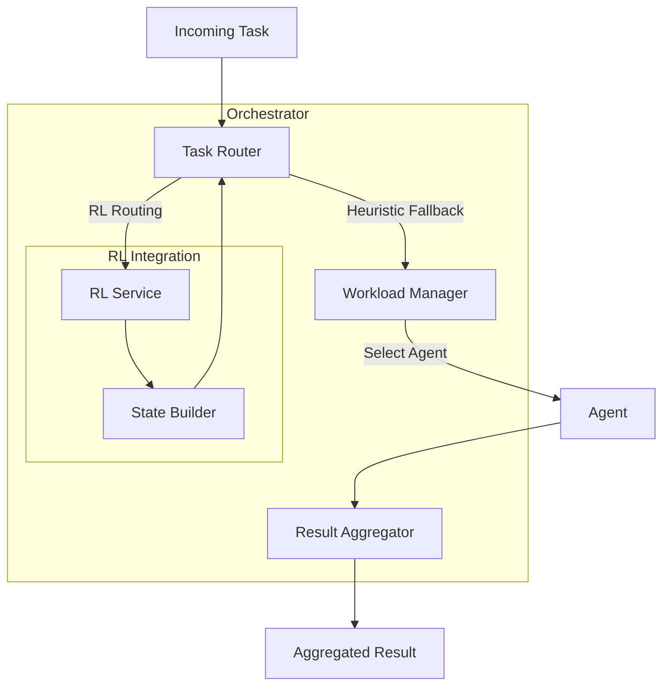

## Communication Flow

### Task Execution Flow

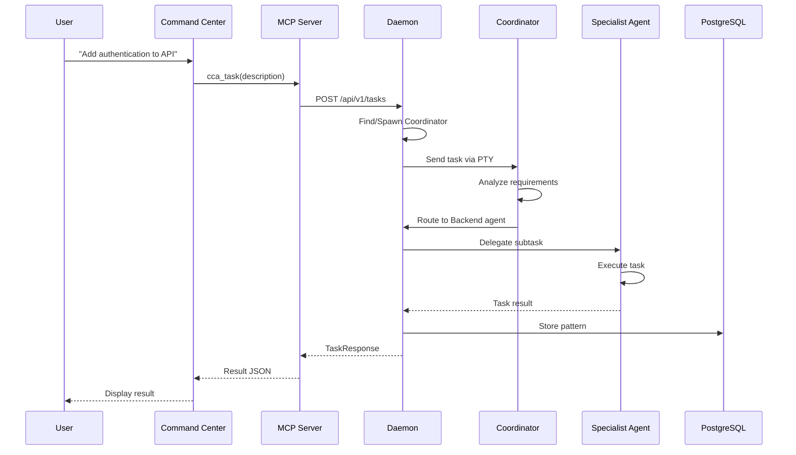

### ACP WebSocket Communication

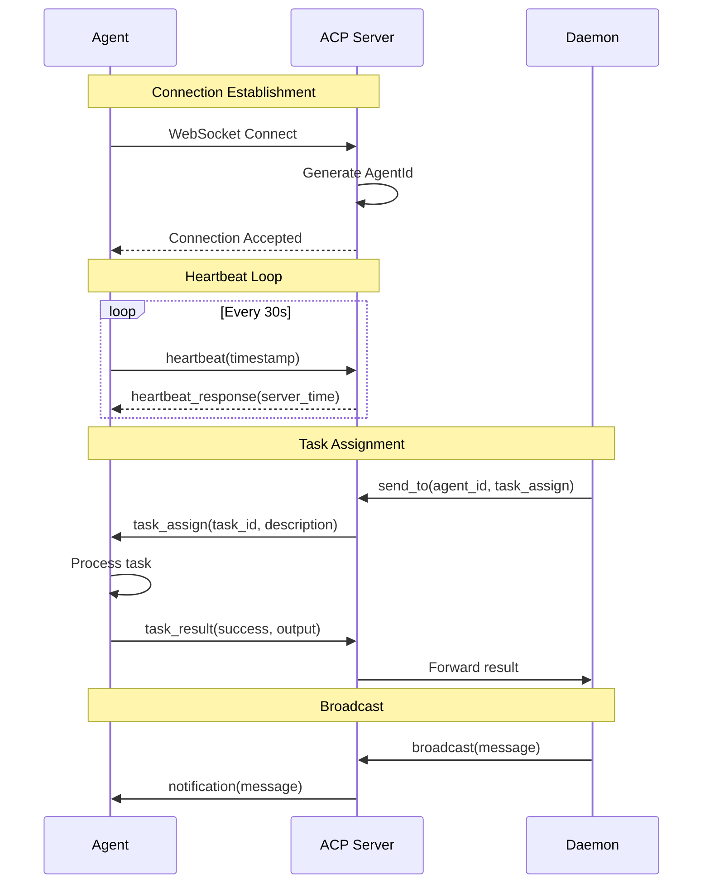

## Data Architecture

### Redis Data Model

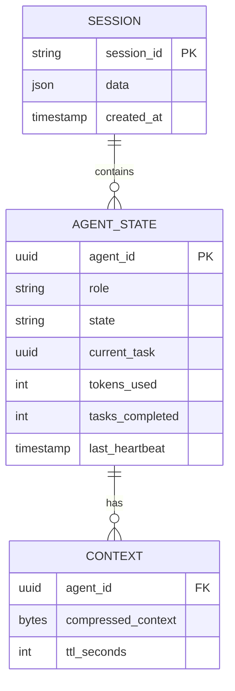

**Redis Key Patterns:**

| Pattern | Purpose |
|---------|---------|
| `cca:session:{id}` | Session data |
| `cca:agent:{id}:state` | Agent state |
| `cca:agent:{id}:context` | Compressed context |
| `cca:broadcast` | Broadcast channel |
| `cca:tasks:{agent_id}` | Task queue per agent |
| `cca:status` | Status updates |
| `cca:coord` | Coordination messages |

### PostgreSQL Schema

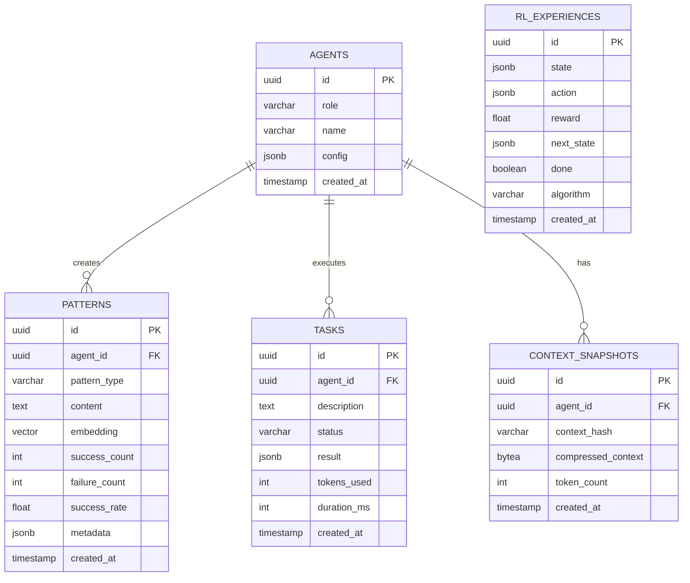

## Reinforcement Learning Architecture

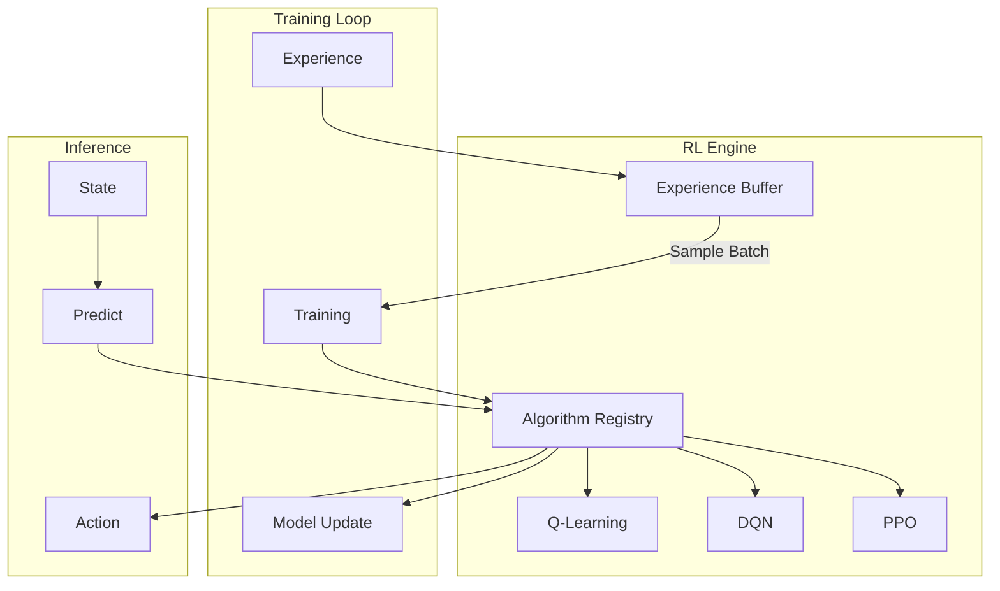

### RL State/Action Space

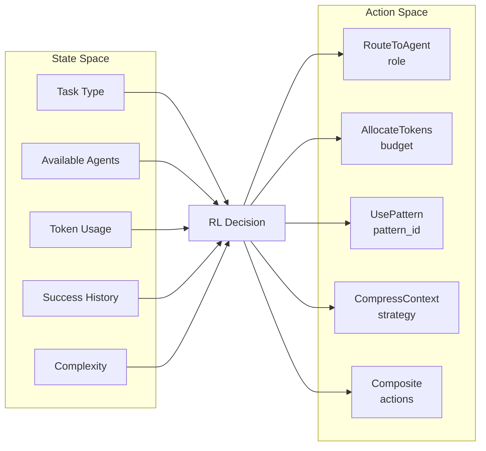

## Token Efficiency System

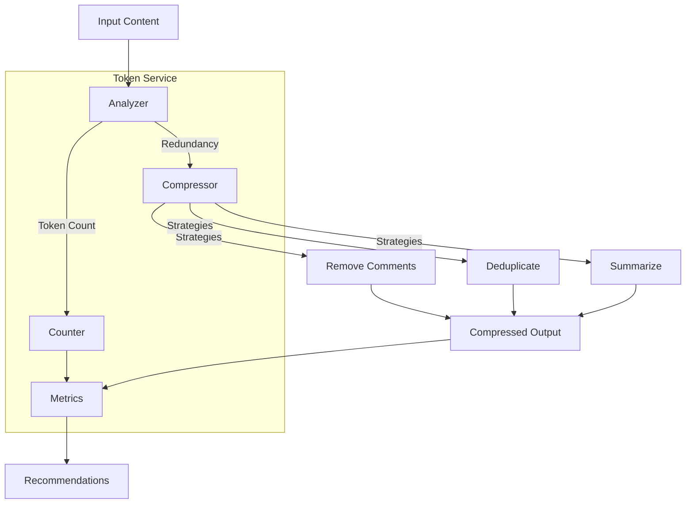

## Deployment Architecture

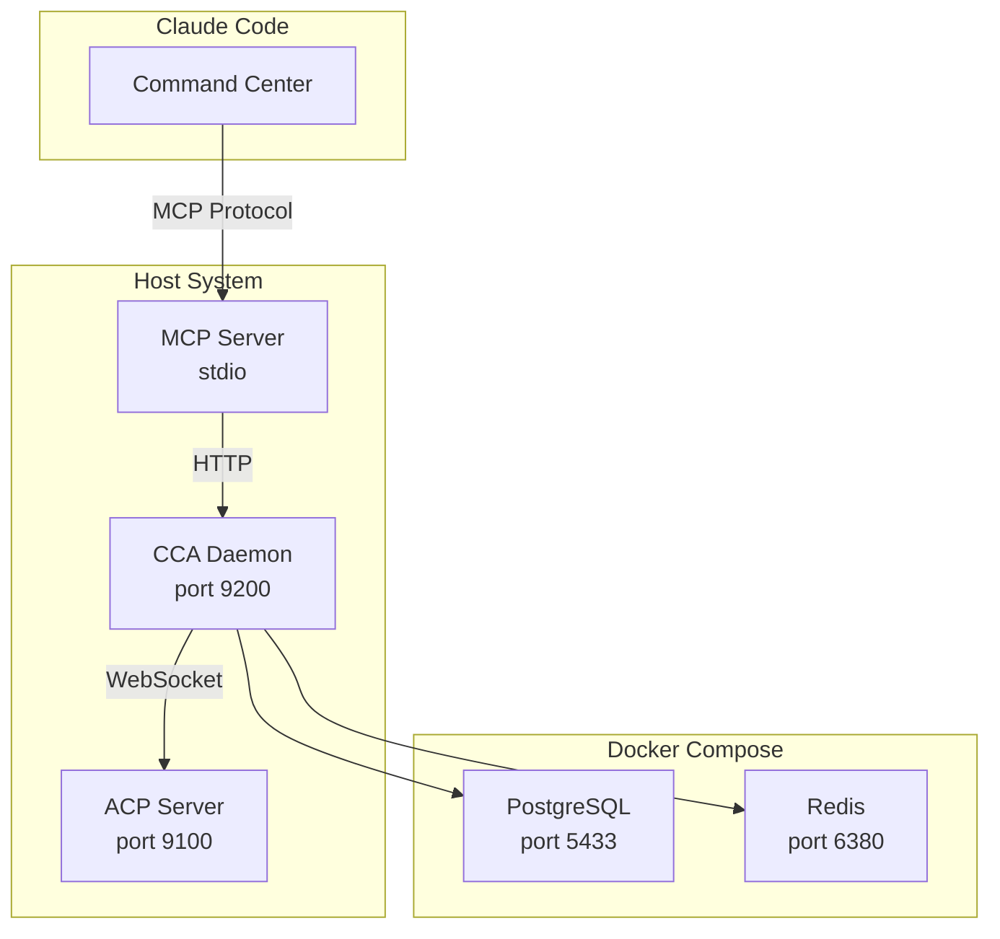

## Security Architecture

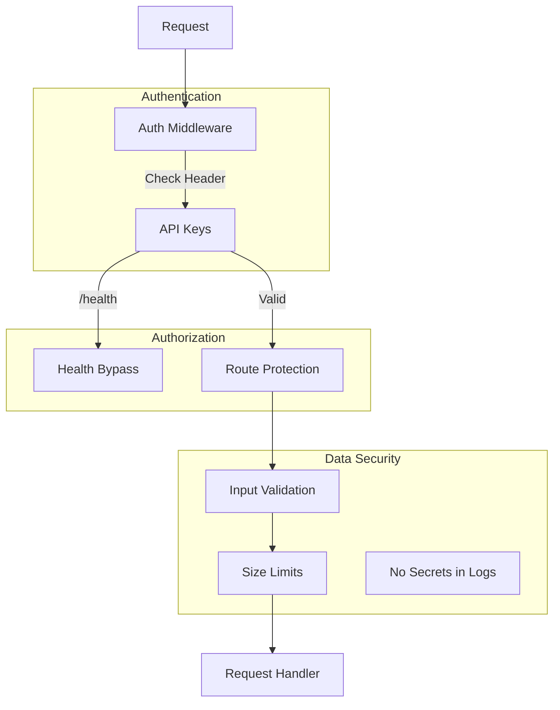

## Module Dependencies

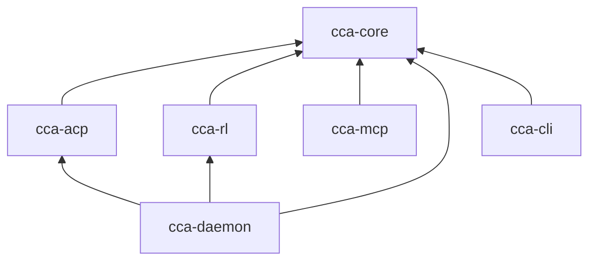

## Performance Considerations

### Connection Pooling

- **Redis**: Configured via `pool_size` (default: 10)
- **PostgreSQL**: Configured via `max_connections` (default: 20)

### Timeouts

| Component | Default Timeout |
|-----------|----------------|
| Agent task | 300 seconds |
| ACP request | 30 seconds |
| HTTP API | 120 seconds |
| PTY response | 30 seconds |

### Scalability

- **Horizontal**: Multiple daemon instances with shared Redis/PostgreSQL
- **Vertical**: Max agents configurable per daemon (default: 10)
- **Token efficiency**: Target 30% reduction in context size
