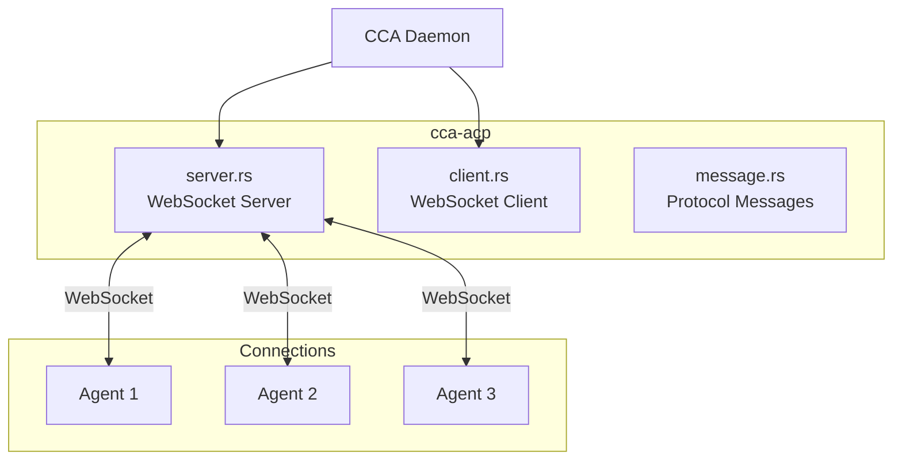
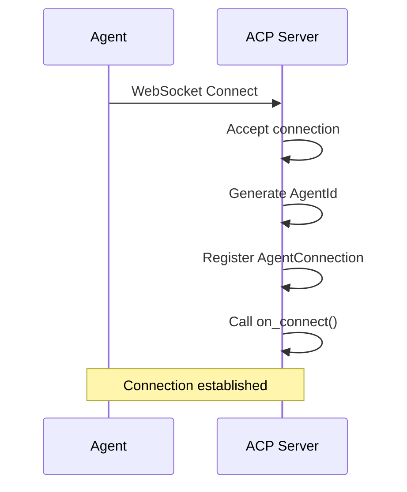
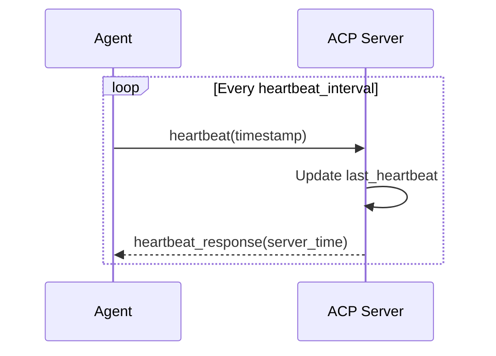
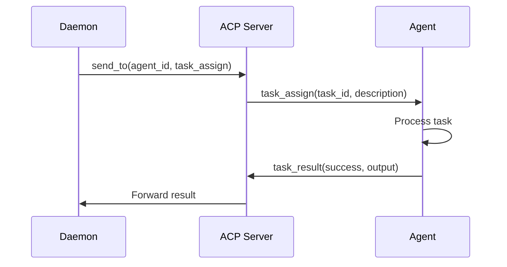
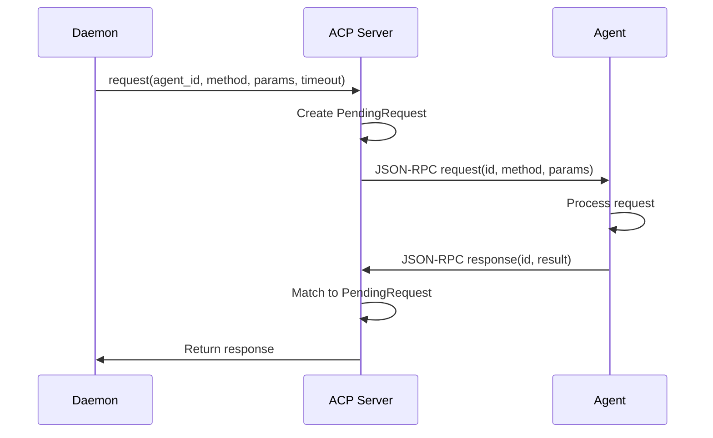
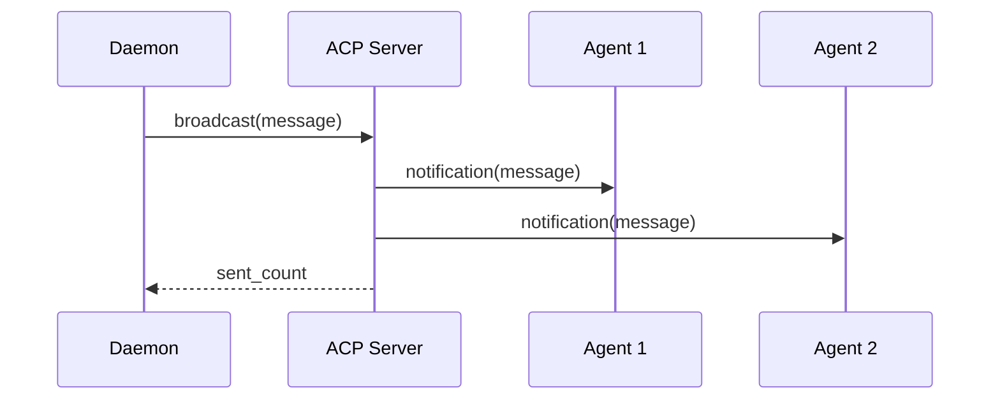

# cca-acp

Agent Communication Protocol (ACP) implementation using WebSocket and JSON-RPC 2.0.

## Overview

The `cca-acp` crate provides real-time communication between the CCA daemon and Claude Code agent instances using WebSocket connections with JSON-RPC 2.0 message format.

## Architecture



## Server Module (`server.rs`)

### AcpServer

Main WebSocket server for agent communication.

```rust
pub struct AcpServer {
    bind_addr: SocketAddr,
    connections: Arc<RwLock<HashMap<AgentId, AgentConnection>>>,
    pending_requests: Arc<RwLock<HashMap<String, PendingRequest>>>,
    message_handler: Arc<dyn MessageHandler>,
    broadcast_tx: broadcast::Sender<AcpMessage>,
    shutdown: broadcast::Sender<()>,
}

impl AcpServer {
    pub fn new(bind_addr: SocketAddr) -> Self;
    pub fn with_handler(self, handler: impl MessageHandler) -> Self;
    pub fn subscribe(&self) -> broadcast::Receiver<AcpMessage>;
    pub async fn run(&self) -> Result<()>;
    pub fn shutdown(&self);

    // Messaging
    pub async fn send_to(&self, agent_id: AgentId, message: AcpMessage) -> Result<()>;
    pub async fn request(&self, agent_id, method, params, timeout) -> Result<AcpMessage>;
    pub async fn broadcast(&self, message: AcpMessage) -> Result<usize>;

    // Connection management
    pub async fn connected_agents(&self) -> Vec<AgentId>;
    pub async fn get_connection(&self, agent_id) -> Option<(uptime, last_heartbeat)>;
    pub async fn connection_count(&self) -> usize;
}
```

### AgentConnection

Per-agent connection state.

```rust
pub struct AgentConnection {
    pub agent_id: AgentId,
    pub sender: mpsc::Sender<String>,
    pub connected_at: Instant,
    pub last_heartbeat: Instant,
    pub metadata: HashMap<String, String>,
}

impl AgentConnection {
    pub fn uptime_seconds(&self) -> u64;
}
```

### MessageHandler

Trait for custom message handling.

```rust
#[async_trait]
pub trait MessageHandler: Send + Sync {
    async fn handle(&self, from: AgentId, message: AcpMessage) -> Option<AcpMessage>;
    async fn on_connect(&self, agent_id: AgentId) {}
    async fn on_disconnect(&self, agent_id: AgentId) {}
}
```

### DefaultHandler

Built-in handler for standard ACP methods.

```rust
pub struct DefaultHandler {
    connections: Arc<RwLock<HashMap<AgentId, AgentConnection>>>,
}

impl MessageHandler for DefaultHandler {
    // Handles: heartbeat, get_status
}
```

## Client Module (`client.rs`)

### AcpClient

WebSocket client with automatic reconnection.

```rust
pub struct AcpClient {
    config: AcpClientConfig,
    state: Arc<RwLock<ConnectionState>>,
    message_rx: mpsc::Receiver<AcpMessage>,
}

impl AcpClient {
    pub async fn connect(config: AcpClientConfig) -> Result<Self>;
    pub async fn send(&self, message: AcpMessage) -> Result<()>;
    pub async fn request(&self, method, params, timeout) -> Result<AcpMessage>;
    pub async fn receive(&mut self) -> Option<AcpMessage>;
    pub fn state(&self) -> ConnectionState;
    pub async fn disconnect(&self);
}
```

### AcpClientConfig

```rust
pub struct AcpClientConfig {
    pub url: String,
    pub agent_id: AgentId,
    pub reconnect_interval: Duration,
    pub max_reconnect_attempts: u32,
    pub heartbeat_interval: Duration,
}
```

### ConnectionState

```rust
pub enum ConnectionState {
    Disconnected,
    Connecting,
    Connected,
    Reconnecting { attempt: u32 },
    Failed { error: String },
}
```

## Message Module (`message.rs`)

### ACP Methods

```rust
pub mod methods {
    pub const HEARTBEAT: &str = "heartbeat";
    pub const TASK_ASSIGN: &str = "task_assign";
    pub const TASK_RESULT: &str = "task_result";
    pub const GET_STATUS: &str = "get_status";
    pub const BROADCAST: &str = "broadcast";
}
```

### Parameter Types

#### HeartbeatParams

```rust
pub struct HeartbeatParams {
    pub timestamp: i64,
}

pub struct HeartbeatResponse {
    pub timestamp: i64,
    pub server_time: i64,
}
```

#### TaskAssignParams

```rust
pub struct TaskAssignParams {
    pub task_id: TaskId,
    pub description: String,
    pub priority: TaskPriority,
    pub parent_task: Option<TaskId>,
    pub token_budget: Option<u64>,
    pub metadata: serde_json::Value,
}
```

#### TaskResultParams

```rust
pub struct TaskResultParams {
    pub task_id: TaskId,
    pub success: bool,
    pub output: String,
    pub tokens_used: u64,
    pub duration_ms: u64,
    pub error: Option<String>,
    pub metadata: serde_json::Value,
}
```

#### BroadcastParams

```rust
pub struct BroadcastParams {
    pub message_type: BroadcastType,
    pub content: serde_json::Value,
}

pub enum BroadcastType {
    Announcement,
    HealthCheck,
    ContextUpdate,
    PatternLearned,
    Custom(String),
}
```

#### StatusResponse

```rust
pub struct StatusResponse {
    pub agent_id: String,
    pub state: String,
    pub current_task: Option<String>,
    pub uptime_seconds: u64,
}
```

## Protocol Flow

### Connection Establishment



### Heartbeat



### Task Assignment



### Request/Response



### Broadcast



## JSON-RPC 2.0 Format

### Request

```json
{
    "jsonrpc": "2.0",
    "id": "unique-request-id",
    "method": "task_assign",
    "params": {
        "task_id": "...",
        "description": "..."
    }
}
```

### Response (Success)

```json
{
    "jsonrpc": "2.0",
    "id": "unique-request-id",
    "result": {
        "status": "ok"
    }
}
```

### Response (Error)

```json
{
    "jsonrpc": "2.0",
    "id": "unique-request-id",
    "error": {
        "code": -32600,
        "message": "Invalid Request"
    }
}
```

### Notification (No Response Expected)

```json
{
    "jsonrpc": "2.0",
    "method": "broadcast",
    "params": {
        "message_type": "announcement",
        "content": { "message": "System update" }
    }
}
```

## Error Codes

| Code | Message | Description |
|------|---------|-------------|
| -32700 | Parse error | Invalid JSON |
| -32600 | Invalid Request | Invalid JSON-RPC |
| -32601 | Method not found | Unknown method |
| -32602 | Invalid params | Invalid parameters |
| -32603 | Internal error | Server error |

## Configuration

```toml
[acp]
websocket_port = 9100
reconnect_interval_ms = 1000
max_reconnect_attempts = 5
```

## Usage Example

### Server

```rust
use cca_acp::AcpServer;
use std::net::SocketAddr;

let addr: SocketAddr = "127.0.0.1:9100".parse()?;
let server = AcpServer::new(addr);

// Run server (blocking)
server.run().await?;

// Or send messages
server.send_to(agent_id, message).await?;
server.broadcast(message).await?;
```

### Client

```rust
use cca_acp::{AcpClient, AcpClientConfig, AcpMessage};

let config = AcpClientConfig {
    url: "ws://127.0.0.1:9100".to_string(),
    agent_id: AgentId::new(),
    reconnect_interval: Duration::from_secs(1),
    max_reconnect_attempts: 5,
    heartbeat_interval: Duration::from_secs(30),
};

let mut client = AcpClient::connect(config).await?;

// Send heartbeat
let response = client.request("heartbeat", json!({"timestamp": now}), timeout).await?;

// Receive messages
while let Some(msg) = client.receive().await {
    // Handle message
}
```

## Dependencies

- `tokio-tungstenite` - WebSocket implementation
- `futures-util` - Stream utilities
- `serde` - Serialization
- `cca-core` - Core types
