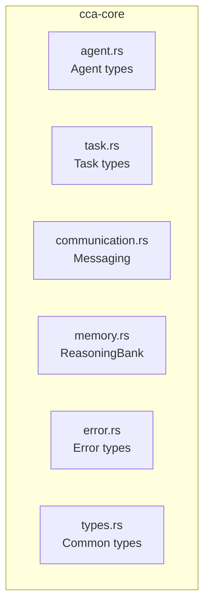

# cca-core

Core types, traits, and shared functionality for the CCA system.

## Overview

The `cca-core` crate provides the foundational types used across all CCA components. It defines the core data structures for agents, tasks, communication, and memory.

## Module Structure



## Agent Module (`agent.rs`)

### AgentId

Unique identifier for agents using UUID v4.

```rust
pub struct AgentId(pub Uuid);

impl AgentId {
    pub fn new() -> Self;
}
```

### AgentRole

Predefined agent roles with support for custom roles.

```rust
pub enum AgentRole {
    Coordinator,  // Routes tasks to specialists
    Frontend,     // Frontend specialist
    Backend,      // Backend specialist
    DBA,          // Database administrator
    DevOps,       // Infrastructure/deployment
    Security,     // Security specialist
    QA,           // Quality assurance
    Custom(String),
}
```

Role conversion from string is case-insensitive:
```rust
AgentRole::from("FRONTEND") == AgentRole::Frontend
AgentRole::from("custom-role") == AgentRole::Custom("custom-role".to_string())
```

### AgentState

Current state of an agent in the lifecycle.

```rust
pub enum AgentState {
    Starting,       // Agent is starting up
    Ready,          // Ready to receive tasks
    Busy,           // Processing a task
    Error(String),  // Encountered an error
    Stopping,       // Shutting down
    Stopped,        // Has stopped
}
```

### Agent

Complete agent information structure.

```rust
pub struct Agent {
    pub id: AgentId,
    pub role: AgentRole,
    pub state: AgentState,
    pub name: Option<String>,
    pub context_hash: Option<String>,
    pub pid: Option<u32>,
}
```

### AgentActivity

Activity information for monitoring.

```rust
pub struct AgentActivity {
    pub agent_id: AgentId,
    pub role: AgentRole,
    pub current_task: Option<String>,
    pub tokens_used: u64,
    pub tasks_completed: u64,
}
```

## Task Module (`task.rs`)

### TaskId

Unique identifier for tasks.

```rust
pub struct TaskId(pub Uuid);
```

### TaskStatus

Task lifecycle status.

```rust
pub enum TaskStatus {
    Pending,
    InProgress,
    Completed,
    Failed(String),
    Cancelled,
}
```

### Task

Complete task structure.

```rust
pub struct Task {
    pub id: TaskId,
    pub description: String,
    pub status: TaskStatus,
    pub priority: TaskPriority,
    pub assigned_to: Option<AgentId>,
    pub parent_task: Option<TaskId>,
    pub token_budget: Option<u64>,
    pub metadata: serde_json::Value,
    pub created_at: DateTime<Utc>,
    pub started_at: Option<DateTime<Utc>>,
    pub completed_at: Option<DateTime<Utc>>,
}
```

### TaskResult

Result returned from task execution.

```rust
pub struct TaskResult {
    pub task_id: TaskId,
    pub success: bool,
    pub output: String,
    pub tokens_used: u64,
    pub duration_ms: u64,
    pub error: Option<String>,
    pub metadata: serde_json::Value,
}
```

## Communication Module (`communication.rs`)

### MessageType

Types of inter-agent messages.

```rust
pub enum MessageType {
    TaskAssign,     // Task assignment from coordinator
    TaskResult,     // Result from execution agent
    StatusUpdate,   // Status update
    Broadcast,      // Broadcast to all agents
    Query,          // Information request
    QueryResponse,  // Response to query
    Heartbeat,      // Health check
    Error,          // Error notification
}
```

### InterAgentMessage

Message structure for agent communication.

```rust
pub struct InterAgentMessage {
    pub id: Uuid,
    pub from: AgentId,
    pub to: MessageTarget,
    pub msg_type: MessageType,
    pub payload: serde_json::Value,
    pub timestamp: DateTime<Utc>,
    pub correlation_id: Option<Uuid>,
}
```

### MessageTarget

Message destination options.

```rust
pub enum MessageTarget {
    Agent(AgentId),  // Single agent
    Broadcast,       // All agents
    Coordinator,     // Coordinator only
}
```

### AcpMessage

JSON-RPC 2.0 compliant ACP message.

```rust
pub struct AcpMessage {
    pub jsonrpc: String,      // Always "2.0"
    pub id: Option<String>,
    pub method: Option<String>,
    pub params: Option<serde_json::Value>,
    pub result: Option<serde_json::Value>,
    pub error: Option<AcpError>,
}
```

Factory methods:
- `AcpMessage::request(id, method, params)` - Create request
- `AcpMessage::notification(method, params)` - Create notification (no id)
- `AcpMessage::response(id, result)` - Create success response
- `AcpMessage::error_response(id, error)` - Create error response

### AcpError

Standard JSON-RPC error codes.

```rust
pub struct AcpError {
    pub code: i32,
    pub message: String,
    pub data: Option<serde_json::Value>,
}

impl AcpError {
    pub fn parse_error() -> Self;      // -32700
    pub fn invalid_request() -> Self;  // -32600
    pub fn method_not_found() -> Self; // -32601
    pub fn invalid_params(msg) -> Self; // -32602
    pub fn internal_error(msg) -> Self; // -32603
}
```

### Channels

Redis pub/sub channel definitions.

```rust
pub mod channels {
    pub const BROADCAST: &str = "cca:broadcast";
    pub const COORDINATION: &str = "cca:coord";
    pub const STATUS: &str = "cca:status";
    pub const LEARNING: &str = "cca:learning";

    pub fn agent_tasks(agent_id: &str) -> String;
    pub fn agent_status(agent_id: &str) -> String;
}
```

## Memory Module (`memory.rs`)

### Pattern

Pattern stored in ReasoningBank.

```rust
pub struct Pattern {
    pub id: PatternId,
    pub agent_id: Option<AgentId>,
    pub pattern_type: PatternType,
    pub content: String,
    pub embedding: Option<Vec<f32>>,
    pub success_count: u32,
    pub failure_count: u32,
    pub metadata: serde_json::Value,
    pub created_at: DateTime<Utc>,
    pub updated_at: DateTime<Utc>,
}
```

Methods:
- `success_rate()` - Calculate success rate
- `record_success()` - Increment success count
- `record_failure()` - Increment failure count

### PatternType

Categories of patterns.

```rust
pub enum PatternType {
    Code,           // Implementation strategy
    Routing,        // Task routing pattern
    ErrorHandling,  // Error handling pattern
    Communication,  // Communication pattern
    Optimization,   // Optimization pattern
    Custom(String), // Custom type
}
```

### ContextSnapshot

Context snapshot for recovery.

```rust
pub struct ContextSnapshot {
    pub id: Uuid,
    pub agent_id: AgentId,
    pub context_hash: String,
    pub compressed_context: Vec<u8>,
    pub token_count: u64,
    pub created_at: DateTime<Utc>,
}
```

### AgentContext

Session context for an agent.

```rust
pub struct AgentContext {
    pub agent_id: AgentId,
    pub conversation_history: Vec<ContextMessage>,
    pub working_directory: String,
    pub active_files: Vec<String>,
    pub token_count: u64,
    pub created_at: DateTime<Utc>,
    pub updated_at: DateTime<Utc>,
}
```

## Error Module (`error.rs`)

### CCAError

Standard error types for the system.

```rust
pub enum CCAError {
    AgentNotFound(AgentId),
    TaskNotFound(TaskId),
    CommunicationError(String),
    ConfigurationError(String),
    StorageError(String),
    TimeoutError(String),
    // ... other variants
}
```

## Usage Example

```rust
use cca_core::{Agent, AgentRole, Task, TaskStatus};

// Create an agent
let agent = Agent::new(AgentRole::Backend)
    .with_name("backend-1");

// Create a task
let mut task = Task::new("Implement authentication");
task.start();

// Later...
task.complete();
```

## Dependencies

- `serde` - Serialization/deserialization
- `uuid` - UUID generation
- `chrono` - Date/time handling
