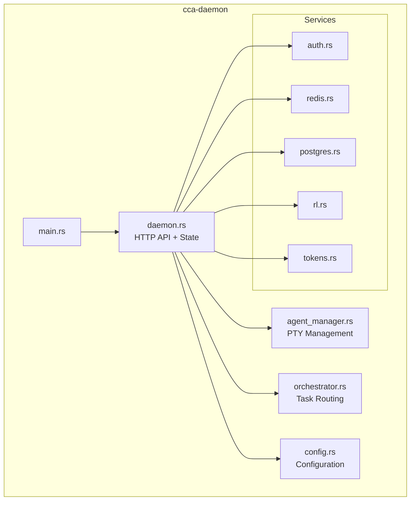
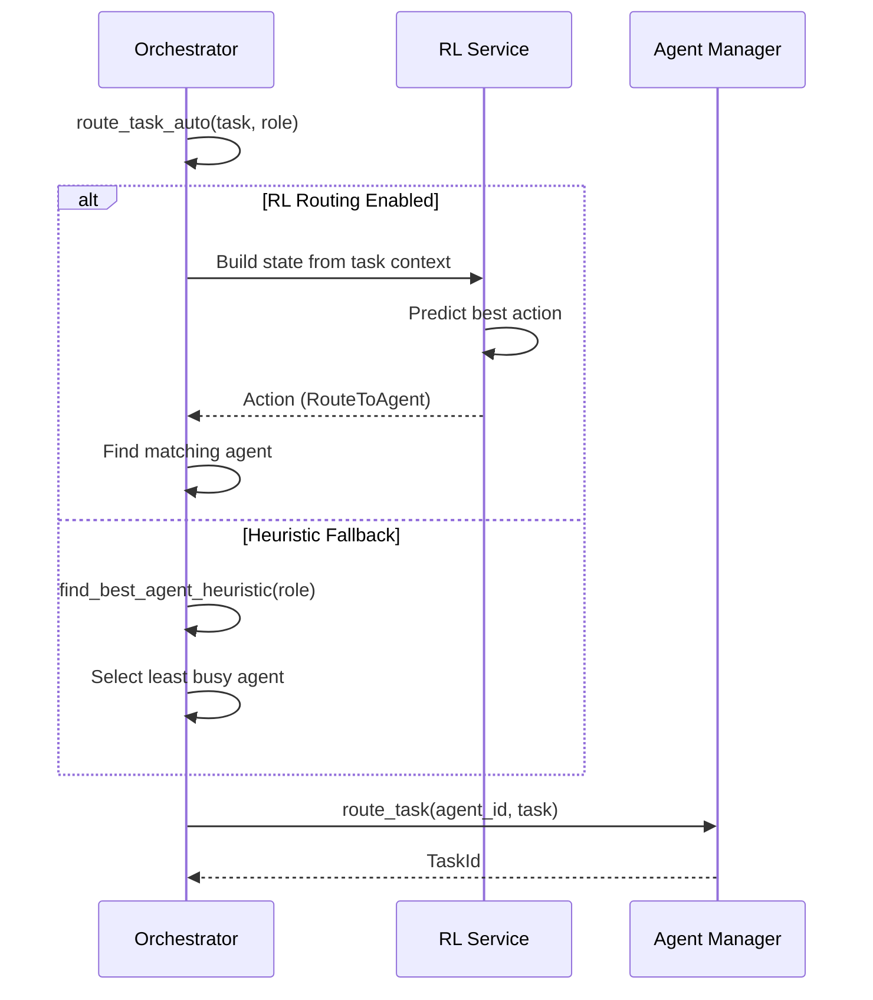

# cca-daemon

Main daemon orchestration service for CCA.

## Overview

The `cca-daemon` crate provides the central orchestration service that manages Claude Code agent instances, handles task routing, and coordinates communication between components.

## Architecture



## Components

### CCADaemon (`daemon.rs`)

Main daemon struct that coordinates all components.

```rust
pub struct CCADaemon {
    config: Config,
    state: DaemonState,
    shutdown: broadcast::Sender<()>,
}

impl CCADaemon {
    pub async fn new(config: Config) -> Result<Self>;
    pub async fn run(&self) -> Result<()>;
    pub async fn shutdown(&self) -> Result<()>;
}
```

### DaemonState

Shared state for API handlers.

```rust
pub struct DaemonState {
    pub config: Config,
    pub agent_manager: Arc<RwLock<AgentManager>>,
    pub orchestrator: Arc<RwLock<Orchestrator>>,
    pub tasks: Arc<RwLock<HashMap<String, TaskState>>>,
    pub redis: Option<Arc<RedisServices>>,
    pub postgres: Option<Arc<PostgresServices>>,
    pub acp_server: Arc<AcpServer>,
    pub rl_service: Arc<RLService>,
    pub token_service: Arc<TokenService>,
}
```

## Agent Manager (`agent_manager.rs`)

Manages Claude Code instances via PTY.

### ManagedAgent

```rust
struct ManagedAgent {
    agent: Agent,
    pty_handle: Option<PtyHandle>,
}

struct PtyHandle {
    stdin_tx: mpsc::Sender<String>,
    stdout_rx: mpsc::Receiver<String>,
    _child: Box<dyn portable_pty::Child>,
}
```

### AgentManager

```rust
pub struct AgentManager {
    agents: HashMap<AgentId, ManagedAgent>,
    config: Config,
}

impl AgentManager {
    pub fn new(config: &Config) -> Self;
    pub async fn spawn(&mut self, role: AgentRole) -> Result<AgentId>;
    pub async fn stop(&mut self, agent_id: AgentId) -> Result<()>;
    pub async fn stop_all(&mut self) -> Result<()>;
    pub fn list(&self) -> Vec<&Agent>;
    pub fn get(&self, agent_id: AgentId) -> Option<&Agent>;
    pub async fn send(&mut self, agent_id: AgentId, message: &str) -> Result<String>;
}
```

### PTY Spawning

The agent manager spawns Claude Code in a PTY:

```rust
// Build command for Claude Code
let mut cmd = CommandBuilder::new(claude_path);
cmd.arg("--dangerously-skip-permissions");
cmd.env("CLAUDE_MD", &claude_md_path);
cmd.env("TERM", "dumb");
cmd.env("NO_COLOR", "1");
```

**Security Note**: The `--dangerously-skip-permissions` flag bypasses Claude Code permission prompts. Only use in sandboxed/trusted environments.

## Orchestrator (`orchestrator.rs`)

Handles task routing and coordination with RL integration.

### AgentWorkload

```rust
pub struct AgentWorkload {
    pub agent_id: AgentId,
    pub role: String,
    pub current_tasks: u32,
    pub max_tasks: u32,
    pub capabilities: Vec<String>,
    pub success_rate: f64,
    pub avg_completion_time: f64,
    pub tasks_completed: u32,
    pub tasks_failed: u32,
}
```

### Orchestrator

```rust
pub struct Orchestrator {
    tasks: Arc<RwLock<HashMap<TaskId, Task>>>,
    agent_workloads: Arc<RwLock<HashMap<AgentId, AgentWorkload>>>,
    pending_aggregations: Arc<RwLock<HashMap<TaskId, PendingAggregation>>>,
    acp_server: Option<Arc<AcpServer>>,
    redis: Option<Arc<RedisServices>>,
    rl_service: Option<Arc<RLService>>,
    use_rl_routing: bool,
}

impl Orchestrator {
    pub fn new() -> Self;
    pub fn with_acp(self, acp_server: Arc<AcpServer>) -> Self;
    pub fn with_redis(self, redis: Arc<RedisServices>) -> Self;
    pub fn with_rl(self, rl_service: Arc<RLService>) -> Self;

    // Agent management
    pub async fn register_agent(&self, agent_id, role, capabilities, max_tasks);
    pub async fn unregister_agent(&self, agent_id: AgentId);

    // Task routing
    pub async fn route_task(&self, agent_id: AgentId, task: Task) -> Result<TaskId>;
    pub async fn route_task_auto(&self, task: Task, role: &str) -> Result<TaskId>;

    // RL-based routing
    async fn find_best_agent_rl(&self, role: &str, task: &Task) -> Result<AgentId>;
    async fn find_best_agent_heuristic(&self, role: &str) -> Result<AgentId>;

    // Multi-agent delegation
    pub async fn delegate_to_specialists(&self, parent_task, subtasks) -> Result<TaskId>;
    pub async fn process_result(&self, result: TaskResult) -> Result<Option<TaskResult>>;

    // Broadcasting
    pub async fn broadcast(&self, broadcast_type, content) -> Result<usize>;
    pub async fn announce(&self, message: &str) -> Result<usize>;
    pub async fn health_check(&self) -> Result<usize>;
}
```

### Task Routing Flow



## Configuration (`config.rs`)

### Config

```rust
pub struct Config {
    pub daemon: DaemonConfig,
    pub redis: RedisConfig,
    pub postgres: PostgresConfig,
    pub agents: AgentsConfig,
    pub acp: AcpConfig,
    pub mcp: McpConfig,
    pub learning: LearningConfig,
}
```

### DaemonConfig

```rust
pub struct DaemonConfig {
    pub bind_address: String,     // Default: "127.0.0.1:9200"
    pub log_level: String,        // Default: "info"
    pub max_agents: usize,        // Default: 10
    pub api_keys: Vec<String>,    // For authentication
    pub require_auth: bool,       // Default: false
}
```

### Configuration Loading

Configuration is loaded in order:
1. `CCA_CONFIG` environment variable
2. `./cca.toml` (current directory)
3. `~/.config/cca/cca.toml` (user config)

Environment variables override config files with `CCA__` prefix:
```bash
CCA__DAEMON__BIND_ADDRESS="0.0.0.0:9200"
CCA__REDIS__URL="redis://custom:6379"
```

## HTTP API

### Endpoints

| Method | Path | Description |
|--------|------|-------------|
| GET | `/health` | Health check |
| GET | `/api/v1/status` | System status |
| GET | `/api/v1/agents` | List agents |
| POST | `/api/v1/agents` | Spawn agent |
| GET | `/api/v1/tasks` | List tasks |
| POST | `/api/v1/tasks` | Create task |
| GET | `/api/v1/tasks/{id}` | Get task status |
| GET | `/api/v1/activity` | Agent activity |
| GET | `/api/v1/redis/status` | Redis status |
| GET | `/api/v1/postgres/status` | PostgreSQL status |
| POST | `/api/v1/memory/search` | Search patterns |
| GET | `/api/v1/acp/status` | ACP WebSocket status |
| POST | `/api/v1/broadcast` | Broadcast message |
| GET | `/api/v1/workloads` | Agent workloads |
| GET | `/api/v1/rl/stats` | RL statistics |
| POST | `/api/v1/rl/train` | Trigger training |
| POST | `/api/v1/rl/algorithm` | Set algorithm |
| POST | `/api/v1/tokens/analyze` | Analyze tokens |
| POST | `/api/v1/tokens/compress` | Compress content |
| GET | `/api/v1/tokens/metrics` | Token metrics |
| GET | `/api/v1/tokens/recommendations` | Efficiency tips |

### Security

Input validation limits:
- Task description: 100KB max
- Broadcast message: 10KB max
- Content analysis: 1MB max
- Memory query: 1KB max

Authentication middleware (when `require_auth: true`):
- Header: `X-API-Key` or `Authorization: Bearer <key>`
- `/health` endpoint bypasses authentication

## Redis Services (`redis.rs`)

### RedisServices

```rust
pub struct RedisServices {
    pub pool: Pool<RedisConnectionManager>,
    pub pubsub: PubSubService,
    pub agent_states: AgentStateService,
    pub context_cache: ContextCacheService,
}
```

### PubSubMessage

```rust
pub enum PubSubMessage {
    TaskAssigned { task_id: TaskId, agent_id: AgentId },
    TaskCompleted { task_id: TaskId, agent_id: AgentId, success: bool },
    AgentStatusChange { agent_id: AgentId, old_state: String, new_state: String },
    Broadcast { from: AgentId, message: String },
}
```

## PostgreSQL Services (`postgres.rs`)

### PostgresServices

```rust
pub struct PostgresServices {
    pub pool: PgPool,
    pub patterns: PatternRepository,
    pub tasks: TaskRepository,
    pub experiences: ExperienceRepository,
}
```

### PatternRepository

```rust
impl PatternRepository {
    pub async fn store(&self, pattern: &Pattern) -> Result<PatternId>;
    pub async fn get(&self, id: PatternId) -> Result<Option<Pattern>>;
    pub async fn search_text(&self, query: &str, limit: i32) -> Result<Vec<Pattern>>;
    pub async fn search_similar(&self, embedding: &[f32], limit: i32) -> Result<Vec<Pattern>>;
    pub async fn count(&self) -> Result<i64>;
}
```

## Token Service (`tokens.rs`)

### TokenService

```rust
pub struct TokenService {
    pub counter: TokenCounter,
    pub analyzer: TokenAnalyzer,
    pub compressor: TokenCompressor,
    pub metrics: TokenMetrics,
}

impl TokenService {
    pub fn new() -> Self;
    pub async fn get_efficiency_summary(&self) -> EfficiencySummary;
}
```

### Compression Strategies

- **Code comments**: Remove unnecessary comments
- **Deduplication**: Remove repeated content
- **Summarization**: Condense verbose sections

## Running the Daemon

```bash
# Start with default config
./target/release/ccad

# Start with custom config
CCA_CONFIG=/path/to/cca.toml ./target/release/ccad

# Override settings via environment
CCA__DAEMON__BIND_ADDRESS="0.0.0.0:9200" ./target/release/ccad
```

## Dependencies

- `axum` - HTTP framework
- `tokio` - Async runtime
- `portable-pty` - PTY management
- `sqlx` - PostgreSQL driver
- `redis` - Redis driver
- `cca-core` - Core types
- `cca-acp` - WebSocket server
- `cca-rl` - RL algorithms
