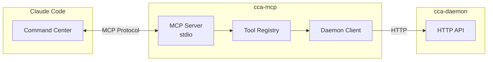

# cca-mcp

Model Context Protocol (MCP) server for Claude Code integration.

## Overview

The `cca-mcp` crate provides the MCP server that integrates CCA with Claude Code. When installed as a plugin, it exposes CCA functionality through MCP tools that Claude Code can invoke.

## Architecture



## Components

### MCP Server (`server.rs`)

JSON-RPC server using stdio transport.

```rust
pub struct McpServer {
    tools: ToolRegistry,
    daemon_url: String,
}

impl McpServer {
    pub fn new(daemon_url: &str) -> Self;
    pub async fn run(&self) -> Result<()>;
}
```

The server handles MCP protocol messages:
- `initialize` - Client initialization
- `tools/list` - List available tools
- `tools/call` - Execute a tool

### Tool Registry (`tools.rs`)

Registry of available MCP tools.

```rust
pub struct ToolRegistry {
    tools: Vec<McpTool>,
}

impl ToolRegistry {
    pub fn new() -> Self;
    pub fn list(&self) -> &[McpTool];
    pub async fn call(&self, name: &str, arguments: &Value, daemon_url: &str) -> Result<String>;
}
```

### Daemon Client (`client.rs`)

HTTP client for communicating with the CCA daemon.

```rust
pub struct DaemonClient {
    base_url: String,
    client: reqwest::Client,
}

impl DaemonClient {
    pub fn new(base_url: &str) -> Self;
    pub async fn health(&self) -> Result<bool>;
    pub async fn status(&self) -> Result<Value>;
    pub async fn create_task(&self, request: &CreateTaskRequest) -> Result<TaskResponse>;
    pub async fn get_task(&self, task_id: &str) -> Result<TaskResponse>;
    pub async fn list_agents(&self) -> Result<Value>;
    pub async fn get_activity(&self) -> Result<Value>;
    pub async fn search_memory(&self, query: &str, limit: i32) -> Result<MemorySearchResponse>;
    // ... more methods
}
```

## Available MCP Tools

### Task Management

#### `cca_task`

Send a task to the CCA system for execution.

**Input Schema:**
```json
{
    "type": "object",
    "properties": {
        "description": {
            "type": "string",
            "description": "The task description - what needs to be done"
        },
        "priority": {
            "type": "string",
            "enum": ["low", "normal", "high", "critical"],
            "description": "Task priority level (default: normal)"
        }
    },
    "required": ["description"]
}
```

**Example:**
```json
{
    "description": "Add JWT authentication to the API",
    "priority": "high"
}
```

**Response:**
```json
{
    "task_id": "uuid",
    "status": "completed",
    "output": "Authentication implemented...",
    "assigned_agent": "coordinator-uuid"
}
```

#### `cca_status`

Check task or system status.

**Input Schema:**
```json
{
    "type": "object",
    "properties": {
        "task_id": {
            "type": "string",
            "description": "Optional task ID to check specific task status"
        }
    }
}
```

### Agent Management

#### `cca_agents`

List all running agents and their status.

**Input Schema:**
```json
{
    "type": "object",
    "properties": {}
}
```

**Response:**
```json
{
    "agents": [
        {
            "agent_id": "uuid",
            "role": "coordinator",
            "status": "Ready",
            "current_task": null
        }
    ]
}
```

#### `cca_activity`

Get current activity of all agents.

**Input Schema:**
```json
{
    "type": "object",
    "properties": {}
}
```

**Response:**
```json
{
    "agents": [
        {
            "agent_id": "uuid",
            "role": "backend",
            "status": "busy",
            "current_task": "task-uuid",
            "last_activity": "2024-01-10T12:00:00Z",
            "tokens_used": 5000,
            "tasks_completed": 10
        }
    ]
}
```

#### `cca_workloads`

Get workload distribution across agents.

**Input Schema:**
```json
{
    "type": "object",
    "properties": {}
}
```

### Memory Operations

#### `cca_memory`

Query the ReasoningBank for learned patterns.

**Input Schema:**
```json
{
    "type": "object",
    "properties": {
        "query": {
            "type": "string",
            "description": "Search query for patterns"
        },
        "limit": {
            "type": "number",
            "description": "Maximum number of results (default: 10)"
        }
    },
    "required": ["query"]
}
```

**Response:**
```json
{
    "patterns": [
        {
            "id": "uuid",
            "pattern_type": "code",
            "content": "Pattern content...",
            "score": 0.95,
            "success_rate": 0.87
        }
    ]
}
```

### Communication

#### `cca_broadcast`

Broadcast a message to all connected agents.

**Input Schema:**
```json
{
    "type": "object",
    "properties": {
        "message": {
            "type": "string",
            "description": "Message to broadcast to all agents"
        }
    },
    "required": ["message"]
}
```

#### `cca_acp_status`

Get ACP WebSocket server status.

**Input Schema:**
```json
{
    "type": "object",
    "properties": {}
}
```

**Response:**
```json
{
    "running": true,
    "port": 9100,
    "connected_agents": 3,
    "agent_ids": ["uuid1", "uuid2", "uuid3"]
}
```

### Reinforcement Learning

#### `cca_rl_status`

Get RL engine status and statistics.

**Input Schema:**
```json
{
    "type": "object",
    "properties": {}
}
```

**Response:**
```json
{
    "algorithm": "q_learning",
    "total_steps": 1000,
    "total_rewards": 850.5,
    "average_reward": 0.85,
    "buffer_size": 500,
    "experience_count": 1000,
    "algorithms_available": ["q_learning", "ppo", "dqn"]
}
```

#### `cca_rl_train`

Trigger RL training on collected experiences.

**Input Schema:**
```json
{
    "type": "object",
    "properties": {}
}
```

#### `cca_rl_algorithm`

Set the RL algorithm to use.

**Input Schema:**
```json
{
    "type": "object",
    "properties": {
        "algorithm": {
            "type": "string",
            "description": "The RL algorithm to use (q_learning, dqn, ppo)"
        }
    },
    "required": ["algorithm"]
}
```

### Token Efficiency

#### `cca_tokens_analyze`

Analyze content for token usage.

**Input Schema:**
```json
{
    "type": "object",
    "properties": {
        "content": {
            "type": "string",
            "description": "The content to analyze for token usage"
        },
        "agent_id": {
            "type": "string",
            "description": "Optional agent ID to associate with analysis"
        }
    },
    "required": ["content"]
}
```

**Response:**
```json
{
    "success": true,
    "total_tokens": 1500,
    "repeated_tokens": 200,
    "code_blocks": 3,
    "long_lines": 5,
    "compression_potential": "25.5%",
    "repeated_lines": 10
}
```

#### `cca_tokens_compress`

Compress content to reduce token usage.

**Input Schema:**
```json
{
    "type": "object",
    "properties": {
        "content": {
            "type": "string",
            "description": "The content to compress"
        },
        "strategies": {
            "type": "array",
            "items": { "type": "string" },
            "description": "Compression strategies: code_comments, history, summarize, deduplicate"
        },
        "target_reduction": {
            "type": "number",
            "description": "Target reduction as decimal 0.0-1.0 (default: 0.3)"
        },
        "agent_id": {
            "type": "string",
            "description": "Optional agent ID to track savings"
        }
    },
    "required": ["content"]
}
```

**Response:**
```json
{
    "success": true,
    "original_tokens": 1500,
    "final_tokens": 1050,
    "tokens_saved": 450,
    "reduction": "30.0%",
    "compressed_content": "..."
}
```

#### `cca_tokens_metrics`

Get token efficiency metrics.

**Input Schema:**
```json
{
    "type": "object",
    "properties": {}
}
```

#### `cca_tokens_recommendations`

Get recommendations for improving token efficiency.

**Input Schema:**
```json
{
    "type": "object",
    "properties": {}
}
```

## Configuration

### Claude Code MCP Settings

Add to your Claude Code MCP configuration:

```json
{
    "mcpServers": {
        "cca": {
            "command": "/path/to/cca-mcp",
            "args": ["--daemon-url", "http://127.0.0.1:9200"]
        }
    }
}
```

### Command Line Options

```
cca-mcp [OPTIONS]

Options:
    --daemon-url <URL>    CCA daemon URL [default: http://127.0.0.1:9200]
    --help                Print help
    --version             Print version
```

## MCP Protocol

The MCP server communicates via stdio using JSON-RPC 2.0.

### Initialize

```json
{
    "jsonrpc": "2.0",
    "id": 1,
    "method": "initialize",
    "params": {
        "protocolVersion": "2024-11-05",
        "capabilities": {},
        "clientInfo": {
            "name": "claude-code",
            "version": "1.0"
        }
    }
}
```

### List Tools

```json
{
    "jsonrpc": "2.0",
    "id": 2,
    "method": "tools/list"
}
```

**Response:**
```json
{
    "jsonrpc": "2.0",
    "id": 2,
    "result": {
        "tools": [
            {
                "name": "cca_task",
                "description": "Send a task to the CCA system...",
                "inputSchema": { ... }
            }
        ]
    }
}
```

### Call Tool

```json
{
    "jsonrpc": "2.0",
    "id": 3,
    "method": "tools/call",
    "params": {
        "name": "cca_task",
        "arguments": {
            "description": "Add authentication"
        }
    }
}
```

## Error Handling

All tools return JSON with error information when failures occur:

```json
{
    "error": "CCA daemon is not running. Start it with: cca daemon start"
}
```

```json
{
    "error": "Failed to create task: Connection refused"
}
```

## Dependencies

- `reqwest` - HTTP client
- `serde_json` - JSON handling
- `tokio` - Async runtime
- `cca-core` - Core types
