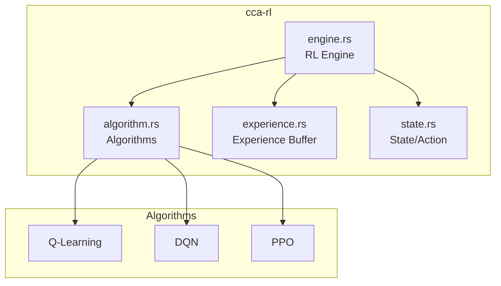
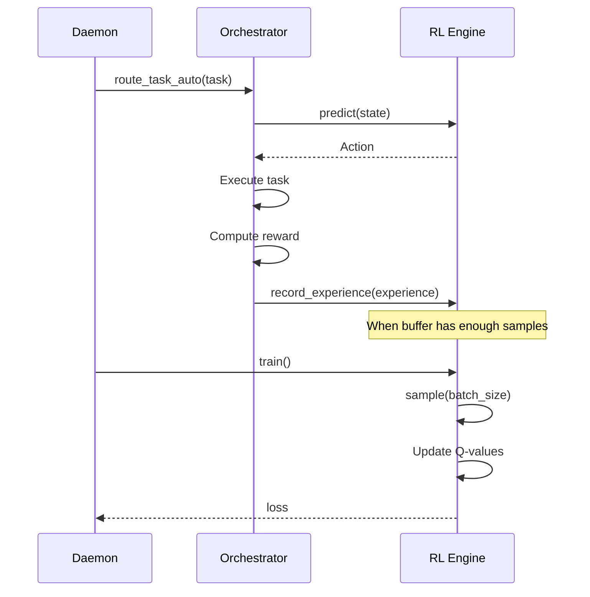

# cca-rl

Reinforcement Learning algorithms for task optimization.

## Overview

The `cca-rl` crate provides RL algorithms for optimizing task routing, token budgeting, and pattern recognition in CCA. It enables the system to learn from experience and make better decisions over time.

## Architecture



## Components

### RL Engine (`engine.rs`)

Coordinates training and inference.

```rust
pub struct RLEngine {
    algorithms: HashMap<String, Box<dyn RLAlgorithm>>,
    active_algorithm: String,
    experience_buffer: ExperienceBuffer,
    training_batch_size: usize,
    total_steps: u64,
    total_rewards: f64,
}

impl RLEngine {
    pub fn new() -> Self;
    pub fn set_algorithm(&mut self, name: &str) -> Result<()>;
    pub fn active_algorithm(&self) -> &str;
    pub fn list_algorithms(&self) -> Vec<&str>;

    // Experience management
    pub fn record_experience(&mut self, experience: Experience);
    pub fn clear_buffer(&mut self);

    // Training
    pub fn train(&mut self) -> Result<f64>;

    // Inference
    pub fn predict(&self, state: &State) -> Action;
    pub fn update_reward(&mut self, reward: Reward) -> Result<()>;

    // Configuration
    pub fn get_algorithm_params(&self) -> serde_json::Value;
    pub fn set_algorithm_params(&mut self, params: Value) -> Result<()>;

    // Statistics
    pub fn stats(&self) -> EngineStats;
}
```

### EngineStats

```rust
pub struct EngineStats {
    pub total_steps: u64,
    pub total_rewards: f64,
    pub average_reward: f64,
    pub buffer_size: usize,
    pub active_algorithm: String,
}
```

## Algorithm Trait (`algorithm.rs`)

```rust
pub trait RLAlgorithm: Send + Sync {
    fn name(&self) -> &str;
    fn train(&mut self, experiences: &[Experience]) -> Result<f64>;
    fn predict(&self, state: &State) -> Action;
    fn update(&mut self, reward: Reward) -> Result<()>;
    fn get_params(&self) -> serde_json::Value;
    fn set_params(&mut self, params: Value) -> Result<()>;
}
```

### Q-Learning

Tabular Q-learning implementation.

```rust
pub struct QLearning {
    q_table: HashMap<String, Vec<f64>>,
    learning_rate: f64,      // Default: 0.1
    discount_factor: f64,    // Default: 0.99
    epsilon: f64,            // Default: 0.1
    action_space_size: usize,
}
```

**Algorithm:**
1. State is discretized to a string key
2. Q-values stored in table per state-action pair
3. Epsilon-greedy action selection
4. Q-value update: `Q(s,a) += α * (r + γ * max(Q(s',a')) - Q(s,a))`
5. Epsilon decay: `ε *= 0.999` (minimum 0.01)

**Parameters:**
```json
{
    "learning_rate": 0.1,
    "discount_factor": 0.99,
    "epsilon": 0.1,
    "q_table_size": 100
}
```

### DQN (Placeholder)

Deep Q-Network using neural networks.

```rust
pub struct DQN {
    // TODO: Implement with neural network backend
}
```

### PPO (Placeholder)

Proximal Policy Optimization.

```rust
pub struct PPO {
    // TODO: Implement
}
```

## State Space (`state.rs`)

### State

```rust
pub struct State {
    pub task_type: String,
    pub available_agents: Vec<AgentState>,
    pub token_usage: f64,          // 0.0 - 1.0
    pub success_history: Vec<f64>,
    pub complexity: f64,           // 0.0 - 1.0
    pub features: Vec<f64>,        // Additional features
}
```

### AgentState

```rust
pub struct AgentState {
    pub role: AgentRole,
    pub is_busy: bool,
    pub success_rate: f64,
    pub avg_completion_time: f64,
}
```

## Action Space (`state.rs`)

### Action

```rust
pub enum Action {
    RouteToAgent(AgentRole),
    AllocateTokens(u32),
    UsePattern(PatternId),
    CompressContext(CompressionStrategy),
    Composite(Vec<Action>),
}

impl Action {
    pub fn action_space_size() -> usize;
    pub fn to_index(&self) -> usize;
    pub fn from_index(index: usize) -> Option<Self>;
}
```

### CompressionStrategy

```rust
pub enum CompressionStrategy {
    RemoveComments,
    Deduplicate,
    Summarize,
    Aggressive,
}
```

## Experience (`experience.rs`)

### Experience

```rust
pub struct Experience {
    pub state: State,
    pub action: Action,
    pub reward: Reward,
    pub next_state: Option<State>,
    pub done: bool,
}

impl Experience {
    pub fn new(state, action, reward, next_state, done) -> Self;
}
```

### ExperienceBuffer

Circular buffer for storing experiences.

```rust
pub struct ExperienceBuffer {
    buffer: Vec<Experience>,
    capacity: usize,
    position: usize,
}

impl ExperienceBuffer {
    pub fn new(capacity: usize) -> Self;
    pub fn push(&mut self, experience: Experience);
    pub fn sample(&self, batch_size: usize) -> Vec<Experience>;
    pub fn len(&self) -> usize;
    pub fn clear(&mut self);
}
```

## Reward Computation

The daemon computes rewards based on task outcomes:

```rust
pub fn compute_reward(
    success: bool,
    tokens_used: u32,
    duration_ms: u32,
    max_tokens: u32,
    max_duration: u32,
) -> f64 {
    let base = if success { 1.0 } else { -0.5 };

    // Token efficiency bonus (0.0 - 0.2)
    let token_bonus = 0.2 * (1.0 - tokens_used as f64 / max_tokens as f64);

    // Speed bonus (0.0 - 0.1)
    let speed_bonus = 0.1 * (1.0 - duration_ms as f64 / max_duration as f64);

    base + token_bonus + speed_bonus
}
```

**Reward Components:**
- Success/Failure: +1.0 / -0.5
- Token efficiency: 0.0 - 0.2
- Speed: 0.0 - 0.1
- Total range: -0.5 to +1.3

## Training Flow



## Usage Example

```rust
use cca_rl::{RLEngine, State, Action, Experience, AgentState as RlAgentState};

// Create engine
let mut engine = RLEngine::new();

// Build state
let state = State {
    task_type: "implement_feature".to_string(),
    available_agents: vec![
        RlAgentState {
            role: AgentRole::Backend,
            is_busy: false,
            success_rate: 0.9,
            avg_completion_time: 5000.0,
        },
    ],
    token_usage: 0.3,
    success_history: vec![1.0, 1.0, 0.0],
    complexity: 0.5,
    features: vec![],
};

// Get prediction
let action = engine.predict(&state);

// Record experience after task completion
let experience = Experience::new(
    state.clone(),
    Action::RouteToAgent(AgentRole::Backend),
    0.95,  // reward
    Some(next_state),
    false,  // not terminal
);
engine.record_experience(experience);

// Train when ready
if engine.stats().buffer_size >= 32 {
    let loss = engine.train()?;
    println!("Training loss: {:.4}", loss);
}
```

## Configuration

```toml
[learning]
enabled = true
default_algorithm = "q_learning"
training_batch_size = 32
update_interval_seconds = 300
```

## Algorithm Selection Guide

| Algorithm | Best For | Pros | Cons |
|-----------|----------|------|------|
| Q-Learning | Simple state spaces | Fast, interpretable | Limited scalability |
| DQN | Complex state spaces | Handles high dimensions | Requires tuning |
| PPO | Continuous actions | Stable training | Higher complexity |

## Metrics

Track RL performance via the daemon API:

```bash
# Get RL stats
curl http://localhost:9200/api/v1/rl/stats

# Trigger training
curl -X POST http://localhost:9200/api/v1/rl/train

# Change algorithm
curl -X POST http://localhost:9200/api/v1/rl/algorithm \
  -H "Content-Type: application/json" \
  -d '{"algorithm": "dqn"}'
```

## Dependencies

- `rand` - Random number generation
- `serde` - Serialization
- `cca-core` - Core types
