# Data Flow

This document describes how data flows through the CCA system.

## Task Execution Flow

### Complete Task Lifecycle

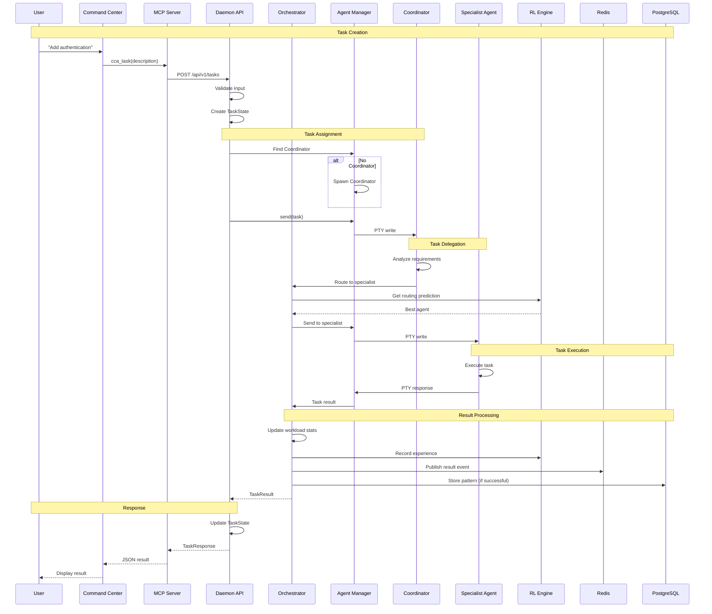

## Agent Communication Flow

### ACP WebSocket Communication

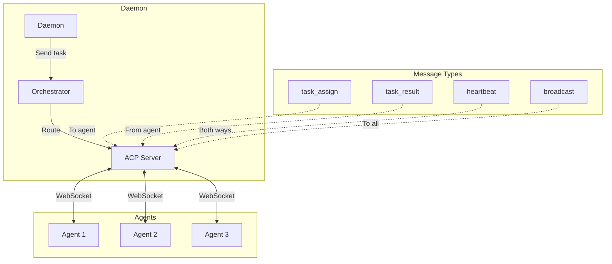

### Redis Pub/Sub Flow

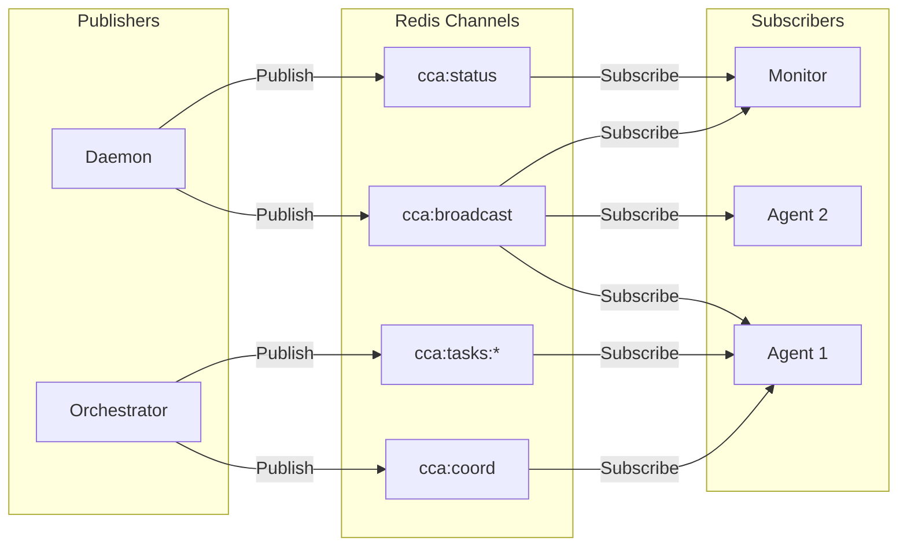

## Memory Flow

### ReasoningBank Pattern Flow

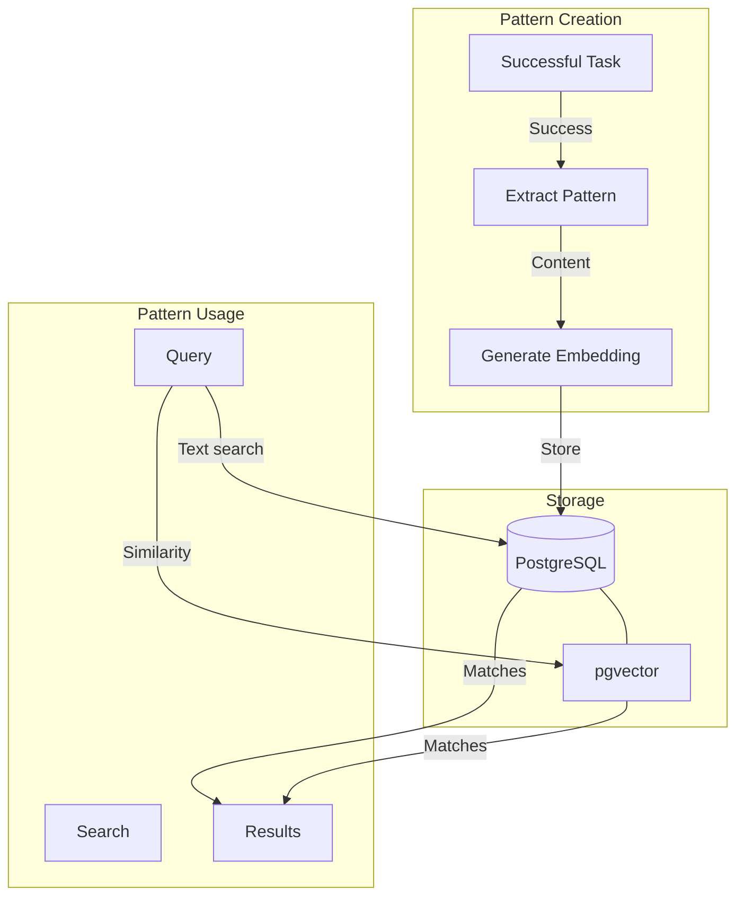

### Context Caching Flow

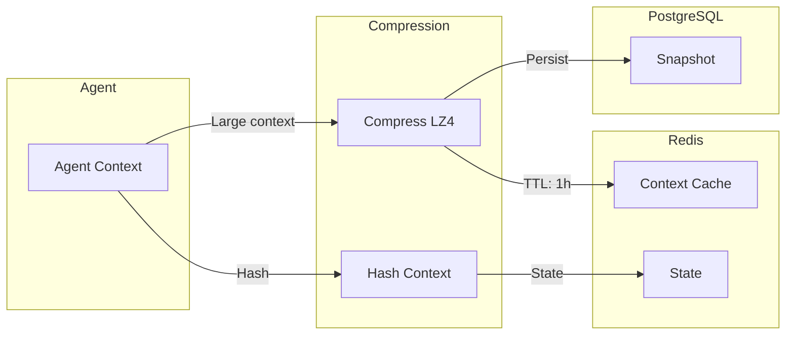

## RL Learning Flow

### Experience Collection

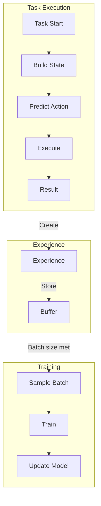

### Reward Computation

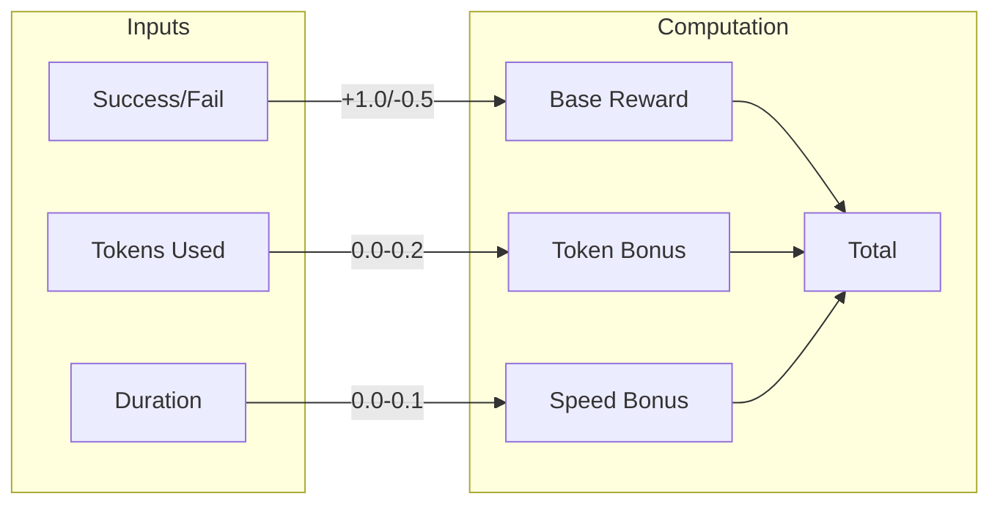

## Token Efficiency Flow

### Analysis Flow

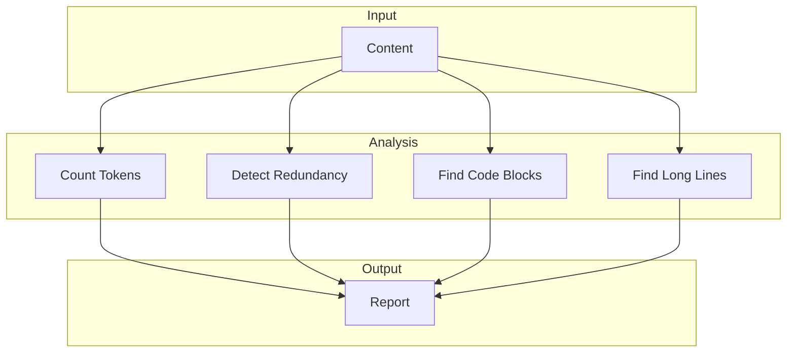

### Compression Flow

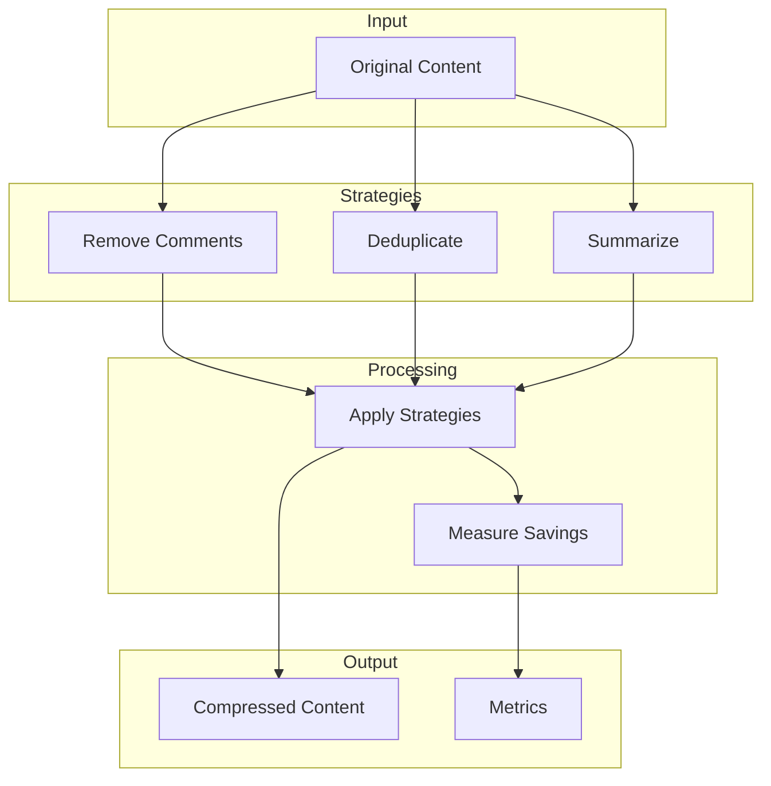

## Data Persistence

### Write Path

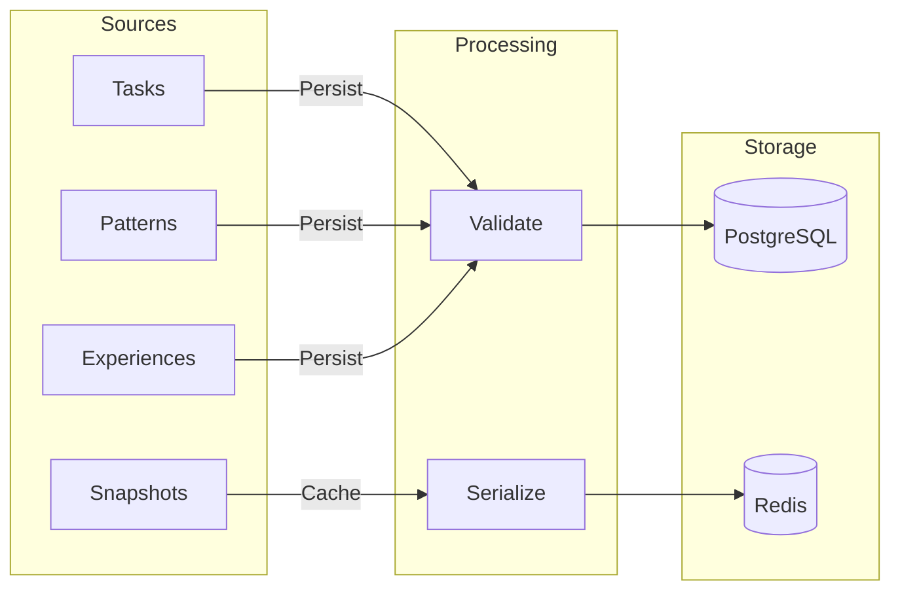

### Read Path

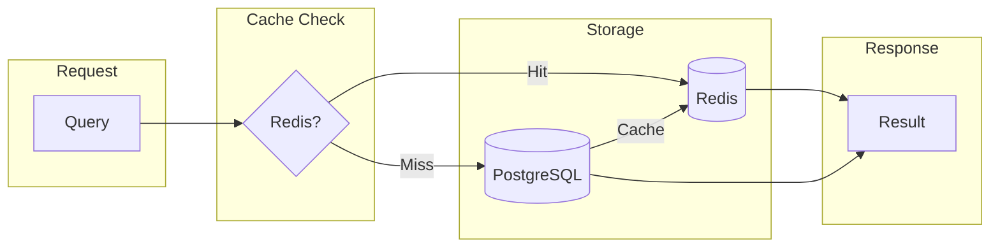

## Error Handling Flow

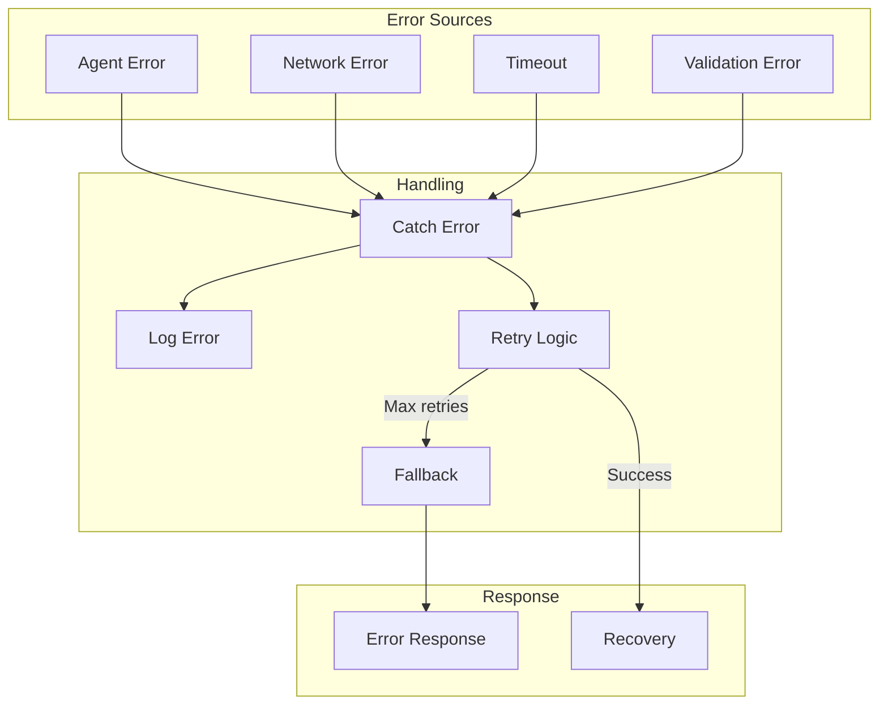
