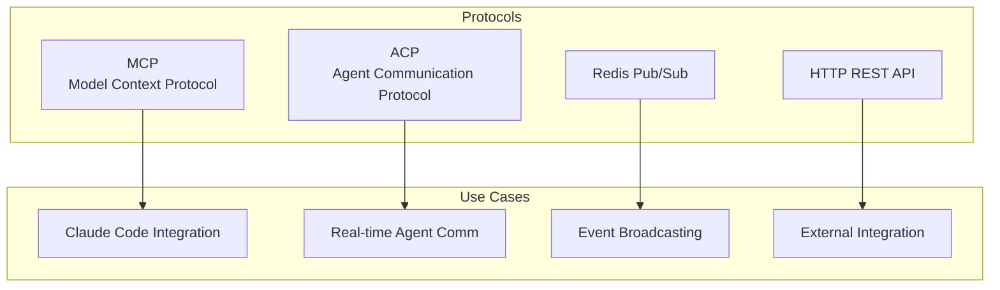
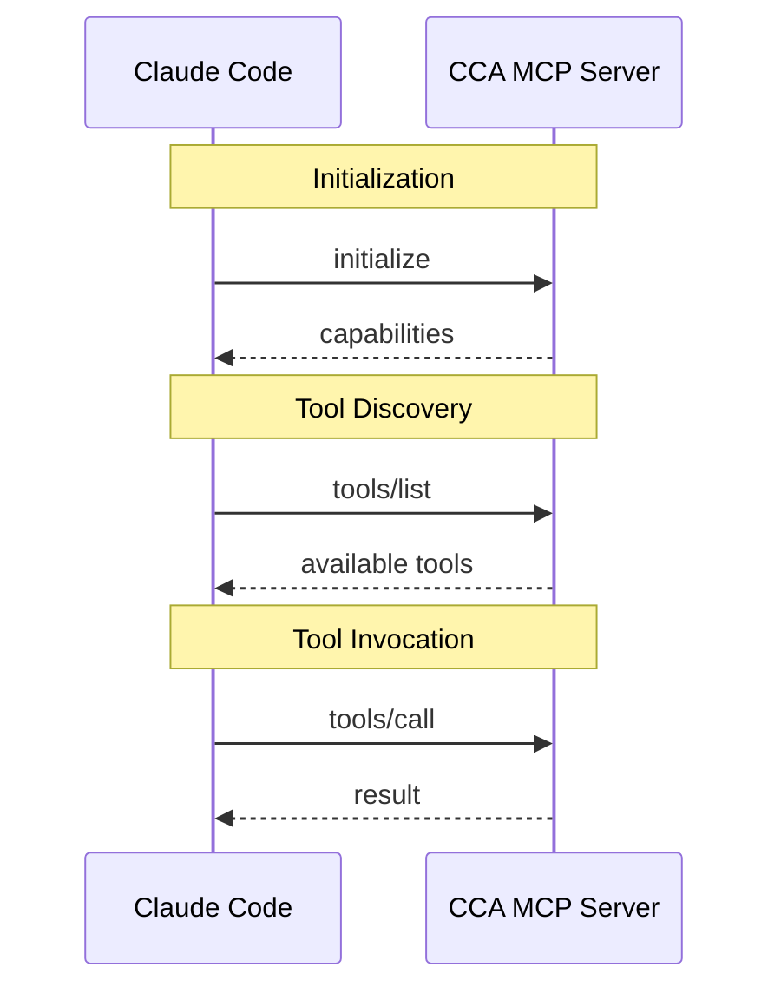
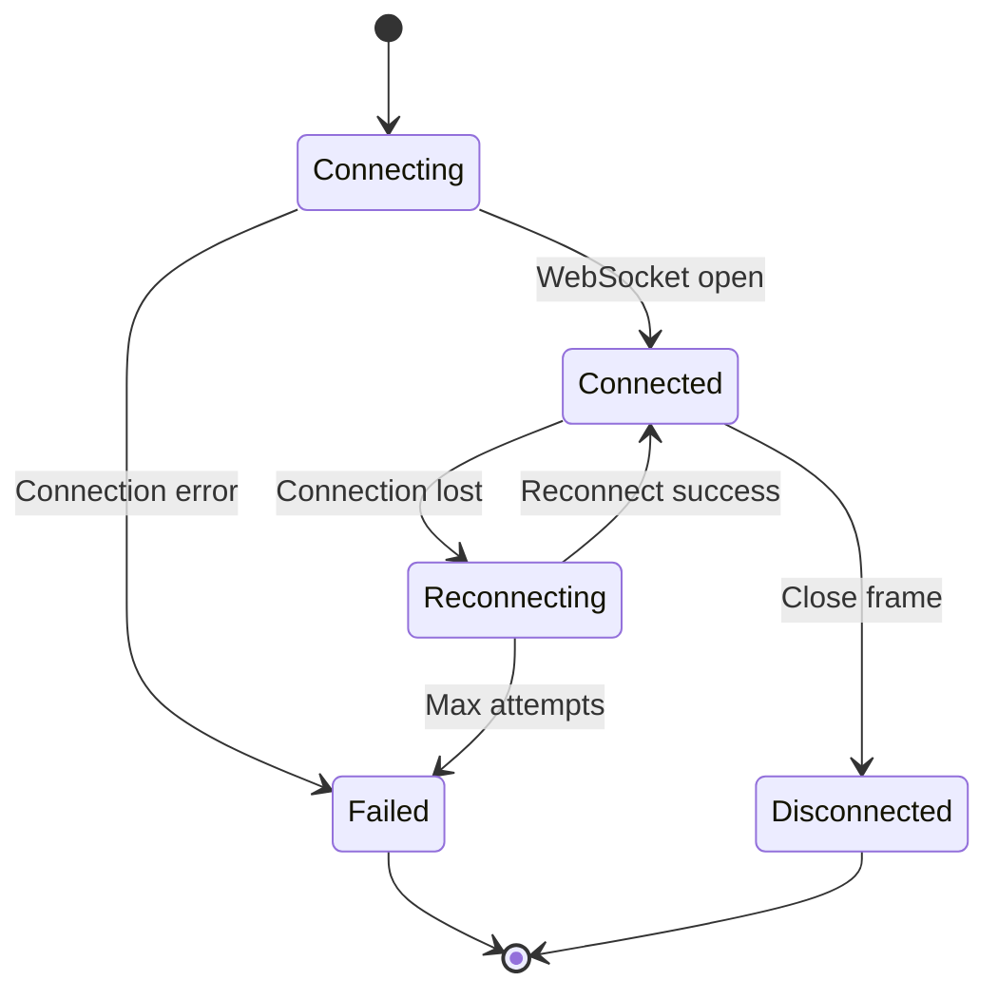

# Communication Protocols

Detailed documentation of the communication protocols used in CCA.

## Protocol Overview



## MCP (Model Context Protocol)

### Overview

MCP is used for Claude Code integration, allowing the CCA system to expose tools that Claude Code can invoke.

### Transport

- **Type**: stdio (standard input/output)
- **Format**: JSON-RPC 2.0 over newline-delimited JSON

### Protocol Flow



### Message Format

#### Initialize Request
```json
{
    "jsonrpc": "2.0",
    "id": 1,
    "method": "initialize",
    "params": {
        "protocolVersion": "2024-11-05",
        "capabilities": {},
        "clientInfo": {
            "name": "claude-code",
            "version": "1.0"
        }
    }
}
```

#### Initialize Response
```json
{
    "jsonrpc": "2.0",
    "id": 1,
    "result": {
        "protocolVersion": "2024-11-05",
        "capabilities": {
            "tools": {}
        },
        "serverInfo": {
            "name": "cca-mcp",
            "version": "0.1.0"
        }
    }
}
```

#### Tools List
```json
{
    "jsonrpc": "2.0",
    "id": 2,
    "result": {
        "tools": [
            {
                "name": "cca_task",
                "description": "Send a task to CCA",
                "inputSchema": {
                    "type": "object",
                    "properties": {
                        "description": {"type": "string"}
                    },
                    "required": ["description"]
                }
            }
        ]
    }
}
```

#### Tool Call
```json
{
    "jsonrpc": "2.0",
    "id": 3,
    "method": "tools/call",
    "params": {
        "name": "cca_task",
        "arguments": {
            "description": "Add authentication"
        }
    }
}
```

#### Tool Result
```json
{
    "jsonrpc": "2.0",
    "id": 3,
    "result": {
        "content": [
            {
                "type": "text",
                "text": "{\"task_id\": \"...\", \"status\": \"completed\"}"
            }
        ]
    }
}
```

## ACP (Agent Communication Protocol)

### Overview

ACP is a custom protocol for real-time communication between the CCA daemon and Claude Code agent instances, built on WebSocket with JSON-RPC 2.0 message format.

### Transport

- **Type**: WebSocket
- **Default Port**: 9100
- **Format**: JSON-RPC 2.0

### Connection Lifecycle



### Methods

| Method | Direction | Description |
|--------|-----------|-------------|
| `heartbeat` | Agent → Server | Health check |
| `task_assign` | Server → Agent | Assign task |
| `task_result` | Agent → Server | Task completion |
| `get_status` | Server → Agent | Request status |
| `broadcast` | Server → Agent | Broadcast message |

### Message Examples

#### Heartbeat Request
```json
{
    "jsonrpc": "2.0",
    "id": "hb-001",
    "method": "heartbeat",
    "params": {
        "timestamp": 1704902400
    }
}
```

#### Heartbeat Response
```json
{
    "jsonrpc": "2.0",
    "id": "hb-001",
    "result": {
        "timestamp": 1704902400,
        "server_time": 1704902401
    }
}
```

#### Task Assign
```json
{
    "jsonrpc": "2.0",
    "id": "task-001",
    "method": "task_assign",
    "params": {
        "task_id": "550e8400-e29b-41d4-a716-446655440000",
        "description": "Implement user authentication",
        "priority": "high",
        "parent_task": null,
        "token_budget": 50000,
        "metadata": {}
    }
}
```

#### Task Result
```json
{
    "jsonrpc": "2.0",
    "id": "result-001",
    "method": "task_result",
    "params": {
        "task_id": "550e8400-e29b-41d4-a716-446655440000",
        "success": true,
        "output": "Authentication implemented...",
        "tokens_used": 15000,
        "duration_ms": 45000,
        "error": null,
        "metadata": {}
    }
}
```

#### Broadcast (Notification)
```json
{
    "jsonrpc": "2.0",
    "method": "broadcast",
    "params": {
        "message_type": "announcement",
        "content": {
            "message": "System maintenance in 5 minutes"
        }
    }
}
```

### Error Codes

| Code | Message | Description |
|------|---------|-------------|
| -32700 | Parse error | Invalid JSON |
| -32600 | Invalid Request | Invalid JSON-RPC |
| -32601 | Method not found | Unknown method |
| -32602 | Invalid params | Invalid parameters |
| -32603 | Internal error | Server error |

### Reconnection Strategy

```
Initial delay: 1000ms
Max attempts: 5
Backoff: exponential (1s, 2s, 4s, 8s, 16s)
```

## Redis Pub/Sub Protocol

### Overview

Redis Pub/Sub is used for event broadcasting and coordination between daemon components and external monitors.

### Channels

| Channel | Purpose | Message Type |
|---------|---------|--------------|
| `cca:broadcast` | Global broadcasts | BroadcastMessage |
| `cca:status` | Status updates | StatusMessage |
| `cca:coord` | Coordination | CoordinationMessage |
| `cca:tasks:{agent_id}` | Per-agent tasks | TaskMessage |
| `cca:status:{agent_id}` | Per-agent status | StatusMessage |

### Message Types

#### Task Assigned
```json
{
    "type": "task_assigned",
    "task_id": "uuid",
    "agent_id": "uuid",
    "timestamp": "2024-01-10T12:00:00Z"
}
```

#### Task Completed
```json
{
    "type": "task_completed",
    "task_id": "uuid",
    "agent_id": "uuid",
    "success": true,
    "timestamp": "2024-01-10T12:05:00Z"
}
```

#### Agent Status Change
```json
{
    "type": "agent_status_change",
    "agent_id": "uuid",
    "old_state": "ready",
    "new_state": "busy",
    "timestamp": "2024-01-10T12:00:00Z"
}
```

#### Broadcast
```json
{
    "type": "broadcast",
    "from": "uuid",
    "message": "System announcement",
    "timestamp": "2024-01-10T12:00:00Z"
}
```

### Subscription Patterns

```redis
# Subscribe to all broadcasts
SUBSCRIBE cca:broadcast

# Subscribe to specific agent
SUBSCRIBE cca:tasks:agent-uuid
SUBSCRIBE cca:status:agent-uuid

# Pattern subscribe
PSUBSCRIBE cca:tasks:*
PSUBSCRIBE cca:status:*
```

## HTTP REST API

### Overview

The HTTP API provides external integration for monitoring, management, and tool access.

### Base URL

```
http://localhost:9200/api/v1
```

### Authentication

```http
X-API-Key: your-api-key
```
or
```http
Authorization: Bearer your-api-key
```

### Content Type

```http
Content-Type: application/json
Accept: application/json
```

### Standard Response Format

#### Success
```json
{
    "data": { ... },
    "meta": {
        "request_id": "uuid",
        "timestamp": "2024-01-10T12:00:00Z"
    }
}
```

#### Error
```json
{
    "error": "Error message",
    "code": "ERROR_CODE",
    "details": { ... }
}
```

### Rate Limiting

(Not yet implemented - planned for future release)

```http
X-RateLimit-Limit: 100
X-RateLimit-Remaining: 95
X-RateLimit-Reset: 1704906000
```

## Protocol Comparison

| Feature | MCP | ACP | Pub/Sub | HTTP |
|---------|-----|-----|---------|------|
| Transport | stdio | WebSocket | Redis | TCP |
| Format | JSON-RPC 2.0 | JSON-RPC 2.0 | JSON | JSON |
| Bidirectional | Yes | Yes | Pub only | No |
| Real-time | No | Yes | Yes | No |
| Authentication | N/A | N/A | N/A | API Key |
| Use Case | Claude Code | Agents | Events | External |

## Protocol Versioning

### MCP Version
- Current: `2024-11-05`
- Negotiated during initialization

### ACP Version
- Current: `1.0`
- Sent in connection metadata

### HTTP API Version
- Current: `v1`
- Included in URL path

## Security Considerations

### MCP
- Runs in same process as Claude Code
- No network exposure
- Trust boundary at process level

### ACP
- WebSocket on localhost by default
- No built-in authentication (planned)
- Agent identity via connection context

### Pub/Sub
- Redis ACL for access control
- Channel naming conventions prevent collisions
- No message encryption (use Redis TLS)

### HTTP
- API key authentication
- HTTPS recommended in production
- Input validation and size limits
